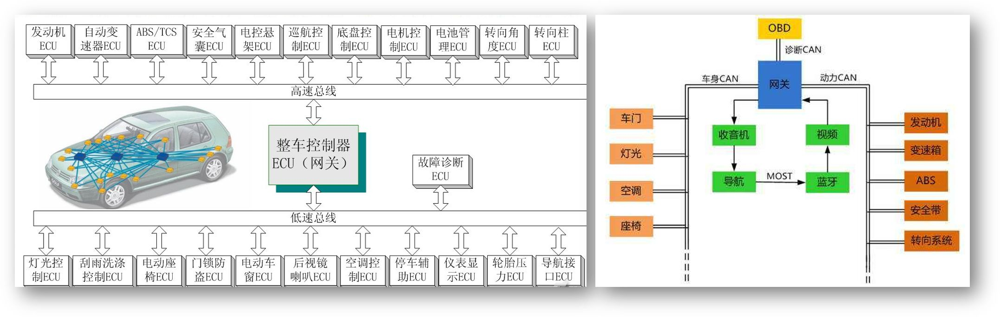
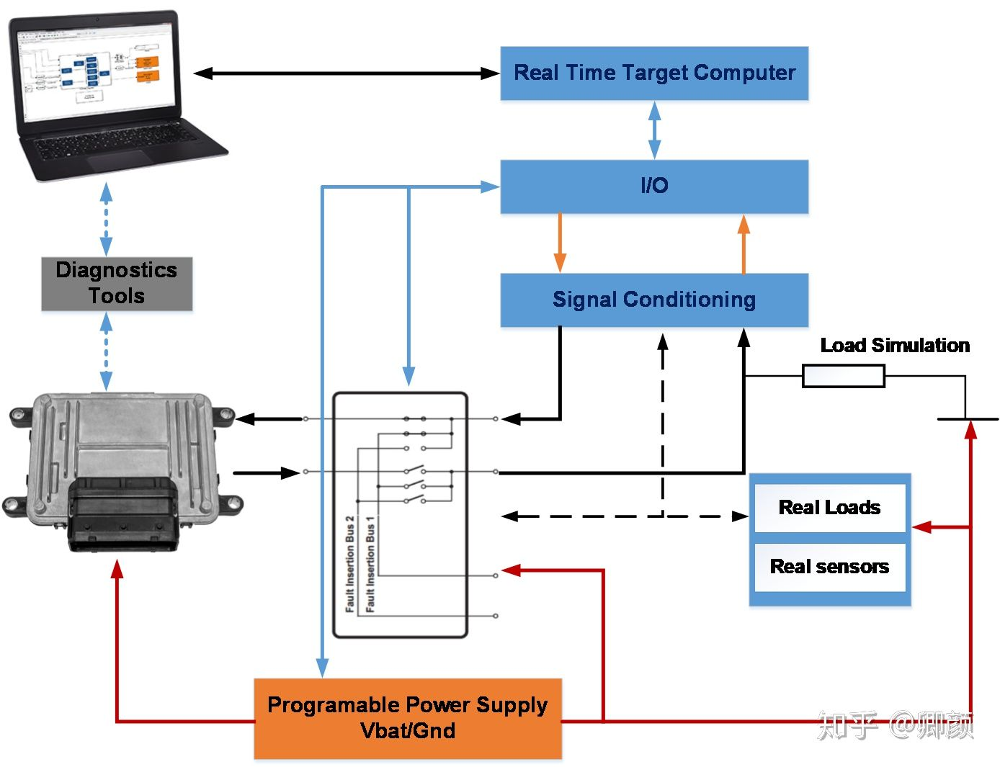
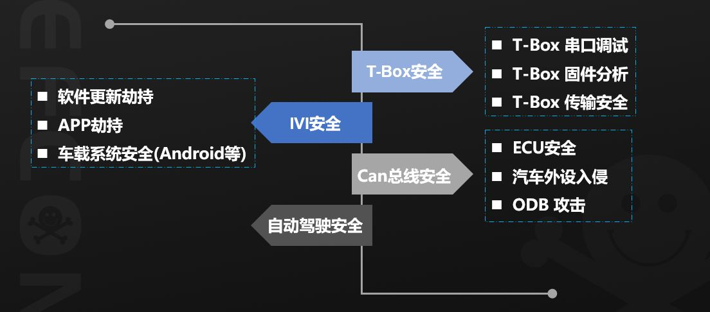

# 车端系统虚拟化
## 理论调研
#### 车端系统

#### 异构网络Heterogeneous Network
所谓异构是指两个或以上的无线通信系统采用了不同的接入技术，或者是采用相同的无线接入技术但属于不同的无线运营商。
* 网络模型的构建、资源管理和网络切换是重难点
* 同构网络 Homogeneous Wireless Networks --- 水平切换 Horizontal Handoff, HHO
* 异构网络 Heterogeneous Network --- 垂直切换 Vertical Handoff，VHO
* [异构网络-百度百科](https://baike.baidu.com/item/%E5%BC%82%E6%9E%84%E7%BD%91%E7%BB%9C#:~:text=%E5%BC%82%E6%9E%84%E7%BD%91%E7%BB%9C(Heterogeneous%20Network,%E4%B8%8D%E5%90%8C%E7%9A%84%E5%8A%9F%E8%83%BD%E6%88%96%E5%BA%94%E7%94%A8%E3%80%82)
#### 可信执行环境
####

# [FireEye]()

# DDos相关
## CC攻击 vs DD攻击 
* 参考文献：  
[CC攻击和DD攻击的区别在哪里](https://zhuanlan.zhihu.com/p/82817326#:~:text=CC%E6%94%BB%E5%87%BB%E7%9A%84%E5%8E%9F%E7%90%86%E6%98%AF%E8%AF%B7%E6%B1%82%E5%B0%B1%E6%98%AF%E6%AD%A3%E5%B8%B8%E7%9A%84%E8%AF%B7%E6%B1%82%E3%80%82)
[什么是DDoS攻击?](https://www.cloudflare.com/zh-cn/learning/ddos/what-is-a-ddos-attack/)

DD攻击：DDos,Distributed Denial of Service,利用目标系统网络服务功能缺陷或者直接消耗其系统资源，使得该目标系统无法提供正常的服务。
* 根据网络层模型，有http洪水攻击（大量请求）、syn洪水攻击（大量SYN包）、容量耗尽攻击（消耗目标与较大的internet之间的所有可用带宽来造成拥塞）、DNS放大攻击（向DNS服务器发出大量请求）等
* 
|  | 层 | 应用 | 描述 | 向量示例  |
|----|----|----|----|----|
7 | 应用 | 数据 | 网络层发展至应用层 | HTTP泛洪，DNS查询洪泛|
6|表示|数据|数据表示和加密|SSL滥用|
5|会话|数据|主机间通信|不适用|
4|运输|行业|端到端连接和可靠性|SYN泛洪|
3|网络|数据包|路径确定和逻辑寻址|UDP反射攻击|
2|数据链路|帧|物理寻址|不适用|
1|物理|位|媒体、信号和二进制传输|不适用|
* 防范措施：黑洞路由、速率限制、WAF（充当反向代理、保护目标服务器、防止其遭受特定类型的恶意流量入侵）、Anycast网络扩散

CC攻击：Challenge Collapsar,本名HTTP-FLOOD,通过代理服务器或者大量肉鸡模拟多个用户访问目标网站的动态页面，制造大量的后台数据库查询动作，消耗目标CPU资源，造成拒绝服务攻击。
* CC攻击的请求本身就是正常的请求，与DDoS可以用硬件防火墙来过滤攻击不同。
* 分为三种：直接攻击、代理攻击、僵尸网络攻击。
两者区别：  
DDoS攻击网站的服务器，攻击WEB网络层，针对比较本源的东西去攻击，服务器瘫痪，导致运行在服务器上的网站都不能正常访问。针对IP的攻击。  
CC攻击网站的页面，攻击WEB应用层，用正常的请求与数据库交互，正常请求达到一定程度，服务器响应不过来，从而崩溃。针对服务器资源的攻击。

## Dos vs DDoS
[什么是DoS和DDoS攻击？](https://www.cloudflare.com/zh-cn/learning/ddos/ddos-attack-tools/how-to-ddos/)
Dos:单机发送恶意流量，形式可以非常简单，比如向目标服务器发送数量超过其有效处理和响应能力的ICMP（ping）请求，发动基本的ping洪水攻击。
DDoS:单机控制一台以上的机器向目标发送恶意流量。
* 常用的DoS/DDoS攻击工具：
  * LOIC:低轨道离子加农炮,Low Orbit Ion Cannon
    * 原理：成千上万的用户协调，向目标服务器发送大量TCP、UDP、HTTP数据包以中断服务。
    * 防护：使用本地防火墙可以防护小型LOIC HTTP攻击，方法是让服务器管理员查看日志并标识攻击者的ip，然后丢弃这些ip发过来的请求。本地防火墙不可防范TCP或UDP洪水，UDP洪水可以瞄准和破坏防火墙，因此可以使用Web应用程序防火墙WAF，针对http洪水进行强大保护，其中专用的DDoS保护可以阻止TCP和UDP攻击
    * 特点：Hivemind蜂群思维。使用LOIC的使用者很容易被发现，LOIC不能通过代理使用，因此攻击者的IP对目标可见。
    * [什么是低轨道离子加农炮 (LOIC)？](https://www.cloudflare.com/zh-cn/learning/ddos/ddos-attack-tools/low-orbit-ion-cannon-loic/)
    * IRC聊天频道：[Internet Relay Chat](https://en.wikipedia.org/wiki/Internet_Relay_Chat)，互联网中继聊天，特点：即时
      * [KRITA-IRC](https://krita.org/zh/irc-zh/) :一个开发人员和 Krita 用户们围绕 Krita 软件的开发进行讨论的场所,Krita是一款可以替代Photoshop和SAI的自由开源的免费绘画软件,用于CG。CG必备软件：Krita、GIMP、Mypaint、Inkscape、Diagrams.net或drow.io、[SAI](https://www.painttoolsai.cn/)
      * 别的一些IRC：[IRC Chat](https://sites.google.com/site/kakurady/irc.en)
      * IRC软件：[Irssi](https://irssi.org/)、[weechat](https://weechat.org/)、[mIRC](https://www.mirc.com/)
  * HOIC
    * [什么是高轨道离子加农炮 (HOIC)？](https://www.cloudflare.com/zh-cn/learning/ddos/ddos-attack-tools/high-orbit-ion-cannon-hoic/)
    * 原理：
    * 特点：简单且界面用户友好
  * Slowloris
    * [Slowloris DDoS 攻击](https://www.cloudflare.com/zh-cn/learning/ddos/ddos-attack-tools/slowloris/)
  * R.U.D.Y
  * [死亡之子 (R.U.D.Y.) 攻击](https://www.cloudflare.com/zh-cn/learning/ddos/ddos-attack-tools/r-u-dead-yet-rudy/)
* 如何防御Dos/DDoS工具：
  * 速率限制：限制服务器特定时间范围内接受的请求数量
  * 使用WEB应用程序防火墙，这些防火墙能基于一系列规则过滤WEB流量
  * Anycast网络扩散:在服务器和传入流量之间置入一个大型分布式晕网络，以提供额外的计算资源来响应请求

## 反射DDoS/DDos的系数放大
# Ping
[vmPing(Visual Multi Ping)](https://github.com/R-Smith/vmPing#:~:text=vmPing%20(Visual%20Multi%20Ping)%20is,utility%20for%20monitoring%20multiple%20hosts.&text=In%20addition%20to%20standard%20ICMPnot%20the%20port%20is%20open.)是一款用于监视多个主机的图形化 Ping 实用程序
## [什么是ICMP？](https://www.cloudflare.com/zh-cn/learning/ddos/glossary/internet-control-message-protocol-icmp/)

## [Ping (ICMP) 洪水 DDoS 攻击](https://www.cloudflare.com/zh-cn/learning/ddos/ping-icmp-flood-ddos-attack/)

## [死亡之 Ping DDoS 攻击](https://www.cloudflare.com/zh-cn/learning/ddos/ping-of-death-ddos-attack/)
# 广播风暴
以太网中出现了明环或暗环，引起广播包被指数涨速递增，整个网络流量被广播包占据，其他的转发业务不能进行。  
以太交换机对广播包的处理，是不管从哪个端口收到广播包，都完整地复制一份转发到其他端口（除接收到的端口外）。

# TCP三次握手、四次挥手
[“三次握手，四次挥手”你真的懂吗？](https://zhuanlan.zhihu.com/p/53374516)
TCP，面向连接的单播协议，发送数据前，双方必须在彼此之间简历一条连接，该连接其实就是客户端和服务器的内存里保存的一份关于对方的信息，比如ip地址、端口号等。
* TCP连接四元组：两个ip地址和两个端口号
* 三次握手：
  * 第一次握手：C-->S：S可知，C发送正常，S接收正常。SYN包。客户端发送一个SYN段，并指明客户端的初始序列号，即ISN(c).
  * 第二次握手：S-->C：C可知，S接收发送正常，C接收发送正常。SYN+ACK包。服务端发送自己的SYN段作为应答，同样指明自己的ISN(s)。为了确认客户端的SYN，将ISN(c)+1作为ACK数值。这样，每发送一个SYN，序列号就会加1. 如果有丢失的情况，则会重传。
  * 第三次握手：C-->S：S可知，C接收发送正常，S发送接收正常。ACK包。为了确认服务器端的SYN，客户端将ISN(s)+1作为返回的ACK数值。
* 四次挥手：
  * 第一次挥手：客户端发送一个FIN段，并包含一个希望接收者看到的自己当前的序列号K. 同时还包含一个ACK表示确认对方最近一次发过来的数据。 
  * 第二次挥手：服务端将K值加1作为ACK序号值，表明收到了上一个包。这时上层的应用程序会被告知另一端发起了关闭操作，通常这将引起应用程序发起自己的关闭操作。 
  * 第三次挥手：服务端发起自己的FIN段，ACK=K+1, Seq=L 
  * 第四次挥手：客户端确认。ACK=L+1
  
* ISN,Initial Sequence Number,如果ISN是固定的，攻击者很容易猜出之后的确认号，则使用hask算法使之随机化，比如ISN=M+hash(localhost,localport,remotehost,remoteport)。
  * tcp序列号回绕：序列号长度为2^31-1，若超出长度，会出现回绕。 

# 机器学习或AI使用，如何找到数据集？
[微软研究院开放数据项目（Microsoft Research Open Data）](https://msropendata.com/datasets/2bda14a7-ee25-4092-8f2f-9272d48ae903):这套新的云数据资料库囊括了微软多年以来在已发表的研究中所使用的数据管理和研究成果。

# GandCrab勒索病毒团队的故事
[赚了20亿美元GandCrab的兴衰史](https://www.leiphone.com/news/201906/ht6dC7vHVQ0K8q98.html)
[GandCrab](https://www.malwarebytes.com/gandcrab/)
# NSA如何开发核武器级的攻击代码

# Google极光行动
[极光行动](https://zh.wikipedia.org/wiki/%E6%9E%81%E5%85%89%E8%A1%8C%E5%8A%A8)
# McAfee老牌安全厂商

# NXP X-MPC5748G-GW
* [MPC5748G Secure Ethernet Gateway Reference Design](https://www.nxp.com/design/designs/mpc5748g-secure-ethernet-gateway-reference-design:MPC5748G-GW-RDB)
  
MPC5748G-GW-RDB是一个参考设计板，旨在提供类似以太网网关ECU的样本，支持安全无线(OTA)管理和功能安全，以帮助加速网关产品的开发和生产。  
MPC5748G- gw - rdb基于32位Power Architecture®MPC5748G超可靠微控制器，MPC5748G- gw - rdb提供多达3个e200内核、硬件安全模块(HSM)、多个通信接口和灵活的内存选项。 

* [MPC5748G-GW-RDB---Quick Start Guide](https://www.nxp.com/docs/en/quick-reference-guide/MPC5748G-GW-RDB_QSG.pdf)
* [MCU Tips: Quick Definitions of CAN, I2C, JTAG, SPI, SWD, and UART](https://bcdevices.com/blogs/the-bridge/mcu-tips-quick-definitions-of-can-i2c-jtag-spi-swd-and-uart)

* 名词解释
  * JTAG：Joint Test Action Group, 提供了一个TAP（测试访问端口）来定义一个边界扫描的标准,引脚最小为4针，一般是10针或14针。（当前拿到X-MPC5748G-GW的是14针）
    * 引脚有:
      * TDI：测试数据输入
      * TDO：测试数据输出
      * TCK：测试时钟
      * TMS：测试模式选择
      * TRST：测试重置（可选）  
  * SPI:Serial Peripheral Interface,串行外设接口，三总线或4总线，具备单独的时钟、数据线、和一个选择线（选择通信设备）。
    * 如果是四总线，线路定义一般为：
      * SCLK：Serial Clocl,串行时钟，从主输出
      * MOSI：Master Output Slave Input/Master Out Slave In,主线输出从属，数据从主线输出
      * MISO：Master Input Slave Output/Master In Slave Out,数据从辅线输出
      * SS：Slave Select,辅线选择,通常活性低，从主输出
    * 引脚有：
      * SDO：Serial Data Out,串行数据输出
      * SDI:Serial Data In,串行数据输入
      * CS:Chip Select,芯片选择
      * COPI：Controller Out Peripheral In,控制器输出和外设输入
      * CIPO：Contriller In Peripheral Out,控制器输入和外设输出
      * SDIO：Serial Data In/Out,串行数据输入输出
    * [JTAG/SWD/ISP/SWIM单片机四种烧写方式](https://blog.csdn.net/LY1941514572/article/details/104543992)
X-MPC5748G-GW内置软件：
* AUTOSAR OS
* MCAL
* Bare-metal S32 SDK
调试工具及步骤：
1. 安装S32 Design Studio IDE
2. 电脑连接JTAG调试端口(jumper?)
3. 根据示意图通电
4. 用IDE调试
# STM32
意法半导体公司的32位微控制器集成电路家族。STM32系列32位微控制器基于Arm®Cortex®-M处理器，旨在为MCU用户提供新的自由度。它提供的产品结合了高性能、实时能力、数字信号处理、低功耗/低压操作和连接，同时保持完全集成和易于开发。 
参考文献
[STM32](https://en.wikipedia.org/wiki/STM32)
# [智能驾驶系列课程](http://learn.baidu.com/pages/index.html#/specialInfo?specialId=3990)学习笔记

# Hardware in the Loop 硬件在还
定义：汽车开发V模型中的环节之一，物理部分被仿真器代替，通过中间的硬件接口接收控制器的控制指令（比如开关开闭的数字信号，或者是阀体的电流控制模拟信号），然后发送控制器需要的传感器和其他信号（比如压力，扭矩，温度信号）给控制器。
通俗解释：硬件在还仿真=真的控制器+假的被控对象。（模拟被控对象，有效地欺骗控制器，在仿真环境下测试ECU的功能。）

技术特点：
* 信号来自接近真实的被控对象，与信号发生器的固定值信号不同，能够更好地测试ECU的控制功能。
* 相对实车，HIL上有故障模拟板卡，用于模拟被控对象的传感器和执行器故障
* 可以进行自动化测试  

设备特点：
① CPU配置很高。一般而言，被控对象模型比较复杂，所以需要硬件在环仿真设备的配置比较高，典型配置如下。  
② 易于将Simulink模型编译、下载到原型控制器中（一般通过网口下载）  
③ IO及通讯接口灵活且丰富，能够满足不同应用的需求，不同应用的接口需求也是大不相同

HIL应用的测试类型：
* 故障诊断测试：通过手工、自动的故障注入（包括电气故障、信号不合理等），实现对诊断功能（OBD II）的测试，诊断功能包括失火诊断、催化剂诊断、氧传感器诊断、电子节气门诊断等。  
* 总线功能测试：通过信号激励等手段，让ECU运转总线功能，并利用总线节点仿真、总线检测等手段测试其总线功能。  
* 控制功能测试：通过驾驶行为输入，并利用ECU被控对象（比如发动机、变速箱等）的仿真，进行ECU完整控制策略的验证
* 性能测试：通过测试案例的自动化运行，进行ECU各种功能的稳定性、可靠性、实时性等性能测试。
  
作用：
* 全面更加全面，因为测试场景和被控对象都是虚拟的，可以轻松创建一些现实世界中较难实现的测试用例来对控制器进行测试。
* 使用自动化测试的手段大大提高测试效率，缩短控制器上市时间。
  *  软件回归测试:每当添加一个新的软件特性时，必须再次彻底测试之前存在的所有功能，以确保没有任何东西被破坏——这是一个非常耗时但又必要的恶魔。通过使用ECU仿真模型、可重用测试脚本和测试用例生成，HIL系统可以自动化并大大加快这一过程。
* HIL可以减少软硬件集成后产生的安全Bug。
* HIL通常还允许一些破坏或损坏真实机器的测试。超出正常范围的传感器数值可以测试在极端工况下，系统是否依然可以安全操作机器。

分类：机柜式和桌面式

核心：模型建立
* 用MATLAB和Simulink相关工具箱构建被控对象模型，Simulink模型主要分为两类：数学模型（主要基于Simulink基础工具箱）和物理模型（基于SimScape）。
* [Basics of Hardware-In-The-Loop simulation](https://www.mathworks.com/help/physmod/simscape/ug/what-is-hardware-in-the-loop-simulation.html)
* [Hardware-In-The-Loop Simulation Workflow](https://www.mathworks.com/help/physmod/simscape/ug/hardware-in-the-loop-simulation-workflow.html)
完整的HIL系统拓扑结构

* 问题
  1. HIL的仿真是用来进行安全性功能测试的，但是我们提到的仿真是为了还原车端系统的攻防，在虚拟环境下模拟攻防对抗技术，这样理解可对？

参考文献
* [请明白人通俗的解释一下什么叫硬件在环？](https://www.zhihu.com/question/32069347)
* [Hardware-in-the-loop simulation](https://en.wikipedia.org/wiki/Hardware-in-the-loop_simulation)
* [What Is Hardware-in-the-Loop?](https://www.ni.com/en-us/innovations/white-papers/17/what-is-hardware-in-the-loop-.html)
* [What is Hardware-in-the-Loop (HIL) Testing?](http://www.genuen.com/blog/what-is-hardware-in-the-loop-hil-testing)
* [Hardware-in-the-loop testing applications](https://www.add2.co.uk/applications/hil/)
* [Hardware-in-the-Loop](https://www.sciencedirect.com/topics/computer-science/hardware-in-the-loop)
# Srl实验室
## [BHAITECH SRL](https://www.cruden.com/bhai-tech/)
[BHAITECH SRL-LINKEDIN](https://www.linkedin.com/company/bhaitech)
意大利的汽车科学实验室
### Specialties
ADAS, Autonomous Driving, Intelligent System Development, Chassis Development, Automotive Components and Systems, Automotive Safety, Intelligent Tire, Vehicle Dynamics, Simulation, Optimization, Motorsport, Augmented Reality, Connected Vehicles, Driving Simulators, and R&D
### Products:
#### [Automotive driving simulators](https://www.cruden.com/automotive-driving-simulators/):用于ADAS和AD测试的驾驶模拟器
技术要点：ADAS/AD测试和驾驶员研究、车辆动力学、车辆建模、图像生成、3D内容和设计流程以及硬件在环(HIL)集成
* 重点是Cruden DIL simulators,该模拟器要解决的问题：
  * Handover moments​
  * Risk analysis on false positives​
  * AD controller driving comfort​
  * HMI and human factors​
  * Testing and validating supplier components and systems​
  * Interaction between car and passengers for autonomous driving​
  * Overcoming motion sickness in autonomous vehicles​
#### [MOTORSPORT DRIVING SIMULATORS](https://www.cruden.com/motorsport-driving-simulators/):静态和动态驾驶模拟器
* 主要应用于驾驶员培训、比赛准备和策略、汽车设置、汽车及组件开发
#### [FAST CRAFT SIMULATION](https://www.cruden.com/marine-simulators/)---快船
#### [MOTORCYCLE SIMULATION](https://www.cruden.com/motorcycle-simulators/)---摩托
#### [PANTHERA SOFTWARE](https://www.cruden.com/panthera-software/)
定义：独立的桌面模拟器应用程序，用于任何运动系统。Panthera使用高端物理和出色的渲染引擎。它包含用于运动平台、转向反馈、踏板、仪表盘、音频等的控制器，以及用于定义和定制模拟的脚本引擎。Panthera提供并管理完整的虚拟环境，通过该环境，整车、ECU或动力系统模型可以进行测试。例如，对于ADAS/AD控制器，地面真实传感器馈电、用于自我和交通车辆的V2V数据流、用于多功能ADAS摄像机的真实视象流和软件开发可以集成到DIL模拟中
Panthera仿真软件功能包括:
* Panthera Master -这是模拟器系统的主要模块。它对仿真进行计时和控制，执行多个监视任务，并为模块和模块之间执行接口联络任务
* 会话管理器-用于操作模拟器的主要GUI。操作人员可以通过选择汽车、道路和车辆设置来进行模拟。一旦配置完成，所有涉及到的硬件和软件模块都可以通过鼠标点击来控制会话
* ePhyse -这是一个通用的接口包，允许在网络上使用(自定义构建的)仿真模型。默认的实现是基于SIMULINK库扩展来控制驻留在实时平台上的车辆模型的配置和状态。集成专用的车辆动力学软件包，如VI-CarRealTime, IPG汽车制造商，CarSim, SIMPACK, VeDYNA, dSPACE ASM, AVL VSM, Dymola，通过ePhyse模块简单而直接
运动提示和控制加载力反馈界面和定制
* 平台跟踪-与舷外投影系统，运动平台的位置和方向被跟踪和投影图像相应调整。这也可以与头部和/或眼球追踪相结合
边缘混合和扭曲-一个内置模块，当投影到任意形状表面时补偿失真。它也平滑地混合每个区域的边缘投影重叠
* Panthera SISTer(与表面和地形交互的服务器)-该软件决定如何轮胎接触补丁与道路交互，或通过多采样多达49个交叉查询每个车轮，或通过直接驾驶在一个密集的点集，空间密度下降到10毫米。这是在频率为1000赫兹或更高的情况下完成的，无需对车辆模型进行额外的计算，且延迟时间小于2毫秒
* 观众视野-类似电视的覆盖，使工程师和观众可以从不同的角度或通过车内摄像机覆盖跟踪车辆
* 数据记录——对于汽车模拟器和赛车模拟器，车辆性能数据可以导出为各种数据格式，包括Matlab，或遥测软件包，如Motec, Darab, Wintax或Pi工具箱
* Panthera设置工具- Cruden开发的车辆模型，以及Simulink兼容的车辆模型，工程师可以改变几乎所有的车辆设置从GUI，其中大部分在运行时
* GPS跟踪器- Panthera仿真环境的实时计时包。它会显示一张地图，上面有车手在虚拟赛道上的位置，以及在一段时间内的(扇区和总)时间
* 接口关于流量和场景

参考文献
* [Contract Vehicle Opportunities](https://srl.com/working-with-srl/contract-vehicle)

# 纯仿真
目前汽车的纯仿真是达不到的，各个厂商正在向着纯仿真努力。难点很多：软硬件的结合（底层硬件的虚拟化）以及功能性传输（协议的虚拟化）等等。  
参考文献  
* [Full Vehicle Simulation for Electrified Powertrain Selection](https://www.mathworks.com/content/dam/mathworks/mathworks-dot-com/company/events/conferences/automotive-conference-michigan/2019/proceedings/full-vehicle-simulation-for-electrified-powertrain-selection.pdf)
# [SIEMENS-西门子](https://new.siemens.com/cn/zh/markets/automotive-manufacturing/references/vinfast.html)
着重研究汽车数字化的公司
## 西门子VSI Labs新型仿真系统
减少对物理原型的需求，加速自动驾驶车辆的开发，显著减少验证自动驾驶系统安全性所需的测试里程数。
* 主要是物理仿真和传感器数据仿真，帮助汽车制造商和供应商缩短车辆开发和验证时间。
* 新系统集成了西门子近期收购的Mentor Graphics公司和TASS International公司的自动驾驶技术。TASS PreScan仿真环境可为无数的潜在驾驶场景、交通状况和其他参数，提供高度逼真的、基于物理学的仿真原始传感器数据。然后，PreScan仿真激光雷达、雷达和摄像机传感器的数据会传输至Mentor Graphics DRS360平台，数据会在该平台中进行实时融合，以创建车辆环境和驾驶条件所需的高分辨率模型。
* 客户可使用DRS360平台的高级感知解决方案和高性能处理，来测试和优化用于关键任务的专有算法，比如对象识别、驾驶策略和其他参数。

参考文献
* [西门子中国-知乎](https://www.zhihu.com/org/xi-men-zi-zhong-guo)
# 自动驾驶仿真
比传统ADAS仿真系统研发更为复杂，对系统在解耦和架构上的要求非常高。一个完整的自动驾驶仿真平台，需要包括静态场景还原、动态案例仿真、传感器仿真、车辆动力学仿真、并行加速计算等功能，并能够较为容易的接入自动驾驶感知和决策控制系统；只有算法与仿真平台紧密结合，才能形成一个闭环，达到持续迭代和优化的状态。
* [自动驾驶系统入门（八）- 自动驾驶仿真技术](https://zhuanlan.zhihu.com/p/97739793)
# 数字孪生 Digital Twin/数字双胞胎:在虚拟空间对物理模型完成映射，反应实体装备的全生命周期。'
将物理模型映射到虚拟空间中
参考文献
* [数字孪生-百度百科](https://baike.baidu.com/item/%E6%95%B0%E5%AD%97%E5%AD%AA%E7%94%9F#:~:text=%E6%95%B0%E5%AD%97%E5%AD%AA%E7%94%9F%E6%98%AF%E5%85%85%E5%88%86%E5%88%A9%E7%94%A8,%E7%B3%BB%E7%BB%9F%E7%9A%84%E6%95%B0%E5%AD%97%E6%98%A0%E5%B0%84%E7%B3%BB%E7%BB%9F%E3%80%82)
* [数字孪生背后的关键技术是什么？](https://www.zhihu.com/question/67438306)
* [数字双胞胎：我们身在何方](https://zhuanlan.zhihu.com/p/39391570)
* [Digital twin-WIKIPEDIA](https://en.wikipedia.org/wiki/Digital_twin#:~:text=A%20digital%20twin%20is%20a,simulation%20of%20spacecraft%20in%202010.)
# 嵌入式系统/嵌入式设备
定义：嵌入式系统由硬件和软件组成．是能够独立进行运作的器件。其软件内容只包括软件运行环境及其操作系统。硬件内容包括信号处理器、存储器、通信模块等在内的多方面的内容。
特点：
* 不支持大容量存储
  
参考文献：
* [嵌入式系统](https://baike.baidu.com/item/%E5%B5%8C%E5%85%A5%E5%BC%8F%E7%B3%BB%E7%BB%9F/186978?fromtitle=%E5%B5%8C%E5%85%A5%E5%BC%8F%E8%AE%BE%E5%A4%87&fromid=10055189)
* [什么是嵌入式，嵌入式应用于哪里？有那些方向？](https://www.zhihu.com/question/23549899)
# NXP

# 车端虚拟化公司调研
## Red Bend软件公司（以下简称“Red Bend”）推出的固件无线更新（FOTA）和虚拟化方案
* [Red Bend Software](https://en.wikipedia.org/wiki/Red_Bend_Software)

# 车端虚拟化的意义
* 有助于充分利用车内计算空间，并进一步压缩硬件成本。
* 软件快速部署，应用于硬件整合、安全性提升及消除IP污染风险级加快产品上市等方面，减少召回并降低保修成本。
* 给现有汽车结构带来根本性变化，以前各项功能都需要有专属处理器，现在数项功能都可通过一个处理器执行，而不会影响性能与可靠性。
  
# 车端虚拟化的挑战
* 软硬件的结合问题：汽车处理器内核发展缓慢、操作系统复杂且多样、无法验证真实硬件上的所有内容
  
# 车端固件模拟运行工具
FIRMADYNE：FIRMADYNE是一个自动化的可扩展系统，用于对基于Linux的嵌入式固件执行仿真和动态分析。
Binwalk：是用于搜索给定二进制镜像文件以获取嵌入的文件和代码的工具
Firmware-Mod-Kit：功能和binwalk工具的类似
MITMproxy
Firmwalker
QEMU是一套由法布里斯·贝拉(Fabrice Bellard)所编写的以GPL许可证分发源码的模拟处理器，在GNU/Linux平台上使用广泛。
Android传感器模拟运行工具：
  * [SensorSimulator](https://github.com/openintents/sensorsimulator)
# 车端虚拟化工具
## Android
* 
## IOT
* [mgarciap/iot-sensor-simulator](https://hub.docker.com/r/mgarciap/iot-sensor-simulator/)
* [fiware/device-simulator](https://hub.docker.com/r/fiware/device-simulator)
* [Rapidly develop Internet of Things apps with Docker Containers](https://developer.ibm.com/articles/iot-docker-containers/)
* [Azure IoT Device Telemetry Simulator](https://docs.microsoft.com/en-us/samples/azure-samples/iot-telemetry-simulator/azure-iot-device-telemetry-simulator/)
* [azure-iot-device-docker](https://github.com/nnmer/azure-iot-device-docker)
* [Iot-Sim-in-Docker4AWS](https://github.com/tribp/Iot-Sim-in-Docker4AWS)
# 智能网联汽车安全

# 自动驾驶安全

# 嵌入式系统

# 同态加密

# 差分隐私

# 联邦学习

# 安全多方计算MPC

# 区块链

# 虚拟化技术
VMware
Microsoft Hyper-V Citrix
XenServer/XenClient
Oracle VirtualBox

Linux:
KVM
KVM虚拟化的上层应用软件和云计算平台：libvirt、Ovirt、Virt-Manager、OpenStack

Xen
Intel、AMD的x86 虚拟化硬件特性：包括基本的CPU VT支持EPT、VPID,以及I/O设备的VT-d,SR-IOV,最新的APIC-v、Shadow VMCS
轻量级虚拟化技术LXC
# 云计算Map/Reduce技术
# 《KVM虚拟化技术实战与原理解析》读书笔记
## 第一章 虚拟化与云计算
云计算是一种通过因特网以服务的方式提供动态可伸缩的虚拟化的资源的计算模式。
* 按使用量付费
* 分布式计算技术的一种，投过网络将庞大的计算处理程序自动拆分成无数个娇小的子程序，再交给多部服务器所组成的庞大系统经搜寻、计算分析之后将处理结果回传给用户。
* 随时获取、按需使用。
* 强调运营效率、竞争力和快速响应
云计算的主要服务形式：
SaaS,Software as a Service,软件即服务，应用软件统一部署在自己的服务器上，用户根据需求订购应用软件服务，服务器根据客户所定的软件数量和时间长短等阴虚收费，通过浏览器向客户提供软件的模式。  
  * 著名公司：Salesforce.com、Google Docs、Google Apps、Zoho Office
PaaS,Platform as a Service,平台即服务，开发环境作为服务来提供，厂商提供开发环境、服务器平台、硬件资源等服务给客户，用户在其平台基础上定制开发自己的应用程序并通过其服务器和互联网传递给其他用户。  
  * 代表产品：Google App Engine、Salesforce的force.com、八百客的800APP
IaaS, Infrastructure as a Service,基础设施即服务，厂商的由多台服务器组成的云端基础设施，作为计量服务提供给客户，它将内存、I/O设备、存储和计算能力整合成一个虚拟的资源池为整个业界提供所需要的存储资源和虚拟化服务器等服务。托管型硬件方式。
  * Amazon Web服务AWS、Google Compute Engine、IBM的BlueCloud

云计算技术
Map/Reduce:用于大规模数据集（大于1TB）的并行运算，思想是将要执行的问题分解成Map(映射)和Reduce(化简)，Map将数据切割成不相关的区块，分配（调度）给大量计算机处理、达到分布式运算的效果，再通过Reduce程序将结果汇总输出。  
  * 适用于分布式搜索、分布式排序、机器学习、基于统计的机器翻译等、Google的搜索索引、Hadoop。

QEMU:软件虚拟机，所有的指令都是软件模拟的，性能比较差，但是可以在同一平台上模拟不同架构平台的虚拟机。  
VMware:动态二进制翻译
# 云计算服务
Amazon AWS：使用弹性计算云EC2、简单存储服务为企业提供计算和存储服务
Google GAE:"平台即服务",PaaS,让第三方开发者在GAE平台上快速地开发自己的Web应用程序，这些应用程序部署在Google全球的数据中心
Google GCE："基础设施即服务"，IaaS,采用KVM虚拟化技术，提供与亚马逊EC2类似的云计算服务。
阿里云
腾讯云
盛大云
新浪云SAE
百度BAE
IBM无锡全球第一个云计算中心
雅虎、惠普和英特尔联合推出云计算研究测试床

# 云计算平台
思杰CloudStack  
Eucalyptus
vCloud Director
OpenStack
Proxmox VE
VirtualBox
OpenQRM
OpenNebula
oVirt

# 
FreeBSD
NetBSD
DPDK
