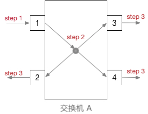
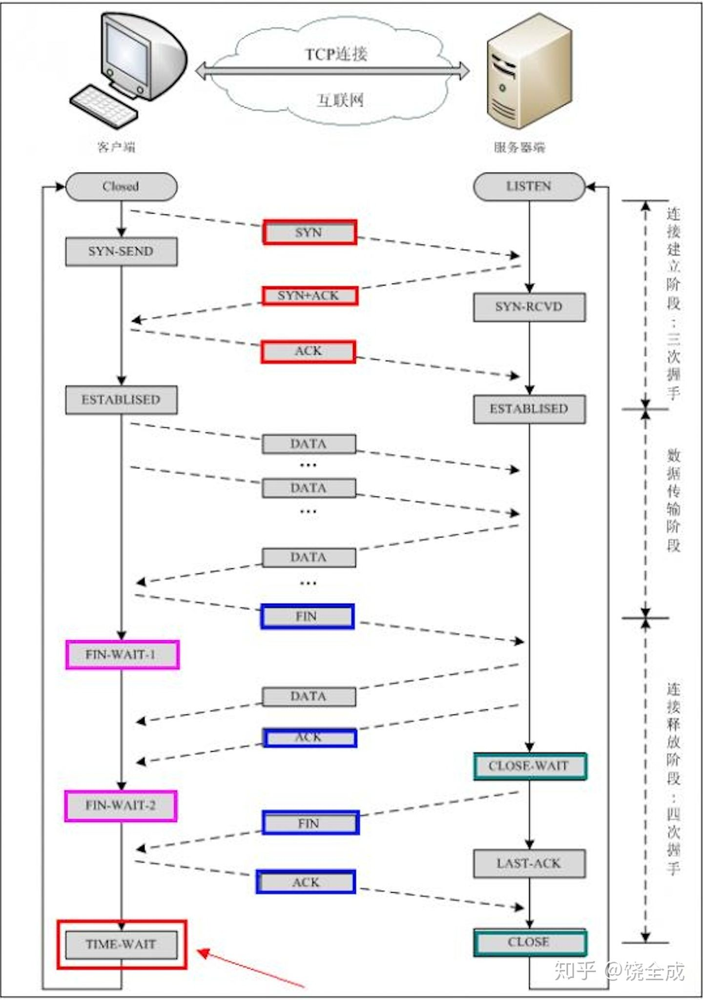
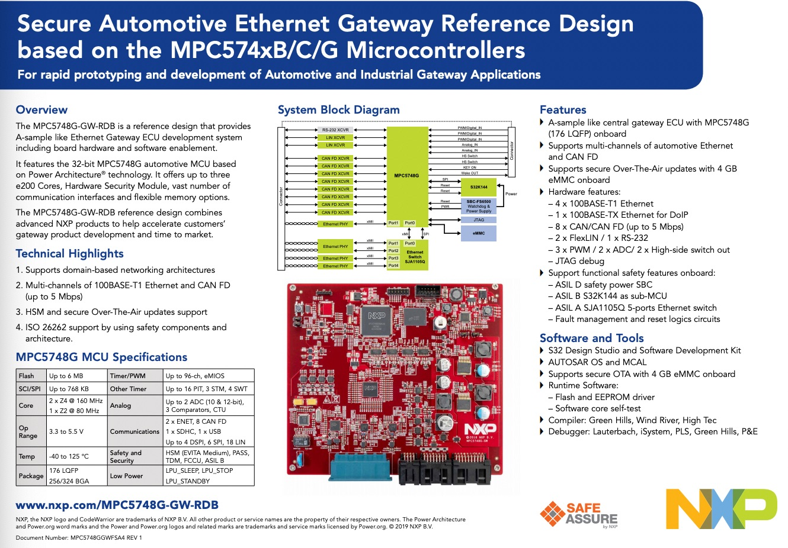
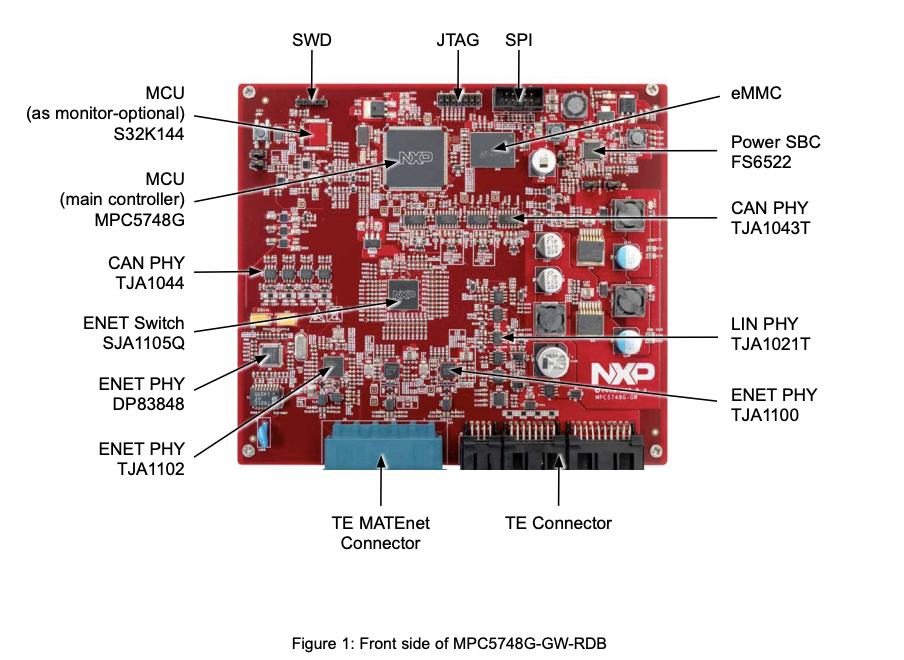

# 车端系统虚拟化
## 理论调研
#### 车端系统
#### 异构网络
#### 可信执行环境
####

# [FireEye]()

# DDos相关
## CC攻击 vs DD攻击 
* 参考文献：  
[CC攻击和DD攻击的区别在哪里](https://zhuanlan.zhihu.com/p/82817326#:~:text=CC%E6%94%BB%E5%87%BB%E7%9A%84%E5%8E%9F%E7%90%86%E6%98%AF%E8%AF%B7%E6%B1%82%E5%B0%B1%E6%98%AF%E6%AD%A3%E5%B8%B8%E7%9A%84%E8%AF%B7%E6%B1%82%E3%80%82)
[什么是DDoS攻击?](https://www.cloudflare.com/zh-cn/learning/ddos/what-is-a-ddos-attack/)

DD攻击：DDos,Distributed Denial of Service,利用目标系统网络服务功能缺陷或者直接消耗其系统资源，使得该目标系统无法提供正常的服务。
* 根据网络层模型，有http洪水攻击（大量请求）、syn洪水攻击（大量SYN包）、容量耗尽攻击（消耗目标与较大的internet之间的所有可用带宽来造成拥塞）、DNS放大攻击（向DNS服务器发出大量请求）等
* 
|  | 层 | 应用 | 描述 | 向量示例  |
|----|----|----|----|----|
7 | 应用 | 数据 | 网络层发展至应用层 | HTTP泛洪，DNS查询洪泛|
6|表示|数据|数据表示和加密|SSL滥用|
5|会话|数据|主机间通信|不适用|
4|运输|行业|端到端连接和可靠性|SYN泛洪|
3|网络|数据包|路径确定和逻辑寻址|UDP反射攻击|
2|数据链路|帧|物理寻址|不适用|
1|物理|位|媒体、信号和二进制传输|不适用|
* 防范措施：黑洞路由、速率限制、WAF（充当反向代理、保护目标服务器、防止其遭受特定类型的恶意流量入侵）、Anycast网络扩散

CC攻击：Challenge Collapsar,本名HTTP-FLOOD,通过代理服务器或者大量肉鸡模拟多个用户访问目标网站的动态页面，制造大量的后台数据库查询动作，消耗目标CPU资源，造成拒绝服务攻击。
* CC攻击的请求本身就是正常的请求，与DDoS可以用硬件防火墙来过滤攻击不同。
* 分为三种：直接攻击、代理攻击、僵尸网络攻击。
两者区别：  
DDoS攻击网站的服务器，攻击WEB网络层，针对比较本源的东西去攻击，服务器瘫痪，导致运行在服务器上的网站都不能正常访问。针对IP的攻击。  
CC攻击网站的页面，攻击WEB应用层，用正常的请求与数据库交互，正常请求达到一定程度，服务器响应不过来，从而崩溃。针对服务器资源的攻击。

## Dos vs DDoS
[什么是DoS和DDoS攻击？](https://www.cloudflare.com/zh-cn/learning/ddos/ddos-attack-tools/how-to-ddos/)
Dos:单机发送恶意流量，形式可以非常简单，比如向目标服务器发送数量超过其有效处理和响应能力的ICMP（ping）请求，发动基本的ping洪水攻击。
DDoS:单机控制一台以上的机器向目标发送恶意流量。
* 常用的DoS/DDoS攻击工具：
  * LOIC:低轨道离子加农炮,Low Orbit Ion Cannon
    * 原理：成千上万的用户协调，向目标服务器发送大量TCP、UDP、HTTP数据包以中断服务。
    * 防护：使用本地防火墙可以防护小型LOIC HTTP攻击，方法是让服务器管理员查看日志并标识攻击者的ip，然后丢弃这些ip发过来的请求。本地防火墙不可防范TCP或UDP洪水，UDP洪水可以瞄准和破坏防火墙，因此可以使用Web应用程序防火墙WAF，针对http洪水进行强大保护，其中专用的DDoS保护可以阻止TCP和UDP攻击
    * 特点：Hivemind蜂群思维。使用LOIC的使用者很容易被发现，LOIC不能通过代理使用，因此攻击者的IP对目标可见。
    * [什么是低轨道离子加农炮 (LOIC)？](https://www.cloudflare.com/zh-cn/learning/ddos/ddos-attack-tools/low-orbit-ion-cannon-loic/)
    * IRC聊天频道：[Internet Relay Chat](https://en.wikipedia.org/wiki/Internet_Relay_Chat)，互联网中继聊天，特点：即时
      * [KRITA-IRC](https://krita.org/zh/irc-zh/) :一个开发人员和 Krita 用户们围绕 Krita 软件的开发进行讨论的场所,Krita是一款可以替代Photoshop和SAI的自由开源的免费绘画软件,用于CG。CG必备软件：Krita、GIMP、Mypaint、Inkscape、Diagrams.net或drow.io、[SAI](https://www.painttoolsai.cn/)
      * 别的一些IRC：[IRC Chat](https://sites.google.com/site/kakurady/irc.en)
      * IRC软件：[Irssi](https://irssi.org/)、[weechat](https://weechat.org/)、[mIRC](https://www.mirc.com/)
  * HOIC
    * [什么是高轨道离子加农炮 (HOIC)？](https://www.cloudflare.com/zh-cn/learning/ddos/ddos-attack-tools/high-orbit-ion-cannon-hoic/)
    * 原理：
    * 特点：简单且界面用户友好
  * Slowloris
    * [Slowloris DDoS 攻击](https://www.cloudflare.com/zh-cn/learning/ddos/ddos-attack-tools/slowloris/)
  * R.U.D.Y
  * [死亡之子 (R.U.D.Y.) 攻击](https://www.cloudflare.com/zh-cn/learning/ddos/ddos-attack-tools/r-u-dead-yet-rudy/)
* 如何防御Dos/DDoS工具：
  * 速率限制：限制服务器特定时间范围内接受的请求数量
  * 使用WEB应用程序防火墙，这些防火墙能基于一系列规则过滤WEB流量
  * Anycast网络扩散:在服务器和传入流量之间置入一个大型分布式晕网络，以提供额外的计算资源来响应请求

## 反射DDoS/DDos的系数放大
# Ping
[vmPing(Visual Multi Ping)](https://github.com/R-Smith/vmPing#:~:text=vmPing%20(Visual%20Multi%20Ping)%20is,utility%20for%20monitoring%20multiple%20hosts.&text=In%20addition%20to%20standard%20ICMPnot%20the%20port%20is%20open.)是一款用于监视多个主机的图形化 Ping 实用程序
## [什么是ICMP？](https://www.cloudflare.com/zh-cn/learning/ddos/glossary/internet-control-message-protocol-icmp/)

## [Ping (ICMP) 洪水 DDoS 攻击](https://www.cloudflare.com/zh-cn/learning/ddos/ping-icmp-flood-ddos-attack/)

## [死亡之 Ping DDoS 攻击](https://www.cloudflare.com/zh-cn/learning/ddos/ping-of-death-ddos-attack/)
# 广播风暴
以太网中出现了明环或暗环，引起广播包被指数涨速递增，整个网络流量被广播包占据，其他的转发业务不能进行。  
以太交换机对广播包的处理，是不管从哪个端口收到广播包，都完整地复制一份转发到其他端口（除接收到的端口外）。

# TCP三次握手、四次挥手
[“三次握手，四次挥手”你真的懂吗？](https://zhuanlan.zhihu.com/p/53374516)
TCP，面向连接的单播协议，发送数据前，双方必须在彼此之间简历一条连接，该连接其实就是客户端和服务器的内存里保存的一份关于对方的信息，比如ip地址、端口号等。
* TCP连接四元组：两个ip地址和两个端口号
* 三次握手：
  * 第一次握手：C-->S：S可知，C发送正常，S接收正常。SYN包。客户端发送一个SYN段，并指明客户端的初始序列号，即ISN(c).
  * 第二次握手：S-->C：C可知，S接收发送正常，C接收发送正常。SYN+ACK包。服务端发送自己的SYN段作为应答，同样指明自己的ISN(s)。为了确认客户端的SYN，将ISN(c)+1作为ACK数值。这样，每发送一个SYN，序列号就会加1. 如果有丢失的情况，则会重传。
  * 第三次握手：C-->S：S可知，C接收发送正常，S发送接收正常。ACK包。为了确认服务器端的SYN，客户端将ISN(s)+1作为返回的ACK数值。
* 四次挥手：
  * 第一次挥手：客户端发送一个FIN段，并包含一个希望接收者看到的自己当前的序列号K. 同时还包含一个ACK表示确认对方最近一次发过来的数据。 
  * 第二次挥手：服务端将K值加1作为ACK序号值，表明收到了上一个包。这时上层的应用程序会被告知另一端发起了关闭操作，通常这将引起应用程序发起自己的关闭操作。 
  * 第三次挥手：服务端发起自己的FIN段，ACK=K+1, Seq=L 
  * 第四次挥手：客户端确认。ACK=L+1
  
* ISN,Initial Sequence Number,如果ISN是固定的，攻击者很容易猜出之后的确认号，则使用hask算法使之随机化，比如ISN=M+hash(localhost,localport,remotehost,remoteport)。
  * tcp序列号回绕：序列号长度为2^31-1，若超出长度，会出现回绕。 

# 机器学习或AI使用，如何找到数据集？
[微软研究院开放数据项目（Microsoft Research Open Data）](https://msropendata.com/datasets/2bda14a7-ee25-4092-8f2f-9272d48ae903):这套新的云数据资料库囊括了微软多年以来在已发表的研究中所使用的数据管理和研究成果。

# GandCrab勒索病毒团队的故事
[赚了20亿美元GandCrab的兴衰史](https://www.leiphone.com/news/201906/ht6dC7vHVQ0K8q98.html)
[GandCrab](https://www.malwarebytes.com/gandcrab/)
# NSA如何开发核武器级的攻击代码

# Google极光行动
[极光行动](https://zh.wikipedia.org/wiki/%E6%9E%81%E5%85%89%E8%A1%8C%E5%8A%A8)
# McAfee老牌安全厂商

# NXP X-MPC5748G-GW
* [MPC5748G Secure Ethernet Gateway Reference Design](https://www.nxp.com/design/designs/mpc5748g-secure-ethernet-gateway-reference-design:MPC5748G-GW-RDB)
  
MPC5748G-GW-RDB是一个参考设计板，旨在提供类似以太网网关ECU的样本，支持安全无线(OTA)管理和功能安全，以帮助加速网关产品的开发和生产。  
MPC5748G- gw - rdb基于32位Power Architecture®MPC5748G超可靠微控制器，MPC5748G- gw - rdb提供多达3个e200内核、硬件安全模块(HSM)、多个通信接口和灵活的内存选项。 

* [MPC5748G-GW-RDB---Quick Start Guide](https://www.nxp.com/docs/en/quick-reference-guide/MPC5748G-GW-RDB_QSG.pdf)
* [MCU Tips: Quick Definitions of CAN, I2C, JTAG, SPI, SWD, and UART](https://bcdevices.com/blogs/the-bridge/mcu-tips-quick-definitions-of-can-i2c-jtag-spi-swd-and-uart)

* 名词解释
  * JTAG：Joint Test Action Group, 提供了一个TAP（测试访问端口）来定义一个边界扫描的标准,引脚最小为4针，一般是10针或14针。（当前拿到X-MPC5748G-GW的是14针）
    * 引脚有:
      * TDI：测试数据输入
      * TDO：测试数据输出
      * TCK：测试时钟
      * TMS：测试模式选择
      * TRST：测试重置（可选）  
  * SPI:Serial Peripheral Interface,串行外设接口，三总线或4总线，具备单独的时钟、数据线、和一个选择线（选择通信设备）。
    * 如果是四总线，线路定义一般为：
      * SCLK：Serial Clocl,串行时钟，从主输出
      * MOSI：Master Output Slave Input/Master Out Slave In,主线输出从属，数据从主线输出
      * MISO：Master Input Slave Output/Master In Slave Out,数据从辅线输出
      * SS：Slave Select,辅线选择,通常活性低，从主输出
    * 引脚有：
      * SDO：Serial Data Out,串行数据输出
      * SDI:Serial Data In,串行数据输入
      * CS:Chip Select,芯片选择
      * COPI：Controller Out Peripheral In,控制器输出和外设输入
      * CIPO：Contriller In Peripheral Out,控制器输入和外设输出
      * SDIO：Serial Data In/Out,串行数据输入输出
  
X-MPC5748G-GW内置软件：
* AUTOSAR OS
* MCAL
* Bare-metal S32 SDK
调试工具及步骤：
1. 安装S32 Design Studio IDE
2. 电脑连接JTAG调试端口(jumper?)
3. 根据示意图通电
4. 用IDE调试

# [智能驾驶系列课程](http://learn.baidu.com/pages/index.html#/specialInfo?specialId=3990)学习笔记

# Hardware in the Loop 硬件在还

# Srl

# 纯仿真

# 西门子

# 自动驾驶仿真

# 数字孪生 Digital Twin/数字双胞胎:在虚拟空间对物理模型完成映射，反应实体装备的全生命周期。
参考文献
* [数字孪生-百度百科](https://baike.baidu.com/item/%E6%95%B0%E5%AD%97%E5%AD%AA%E7%94%9F#:~:text=%E6%95%B0%E5%AD%97%E5%AD%AA%E7%94%9F%E6%98%AF%E5%85%85%E5%88%86%E5%88%A9%E7%94%A8,%E7%B3%BB%E7%BB%9F%E7%9A%84%E6%95%B0%E5%AD%97%E6%98%A0%E5%B0%84%E7%B3%BB%E7%BB%9F%E3%80%82)
# 同态加密

# 差分隐私

# 联邦学习

# 安全多方计算MPC

# 区块链

