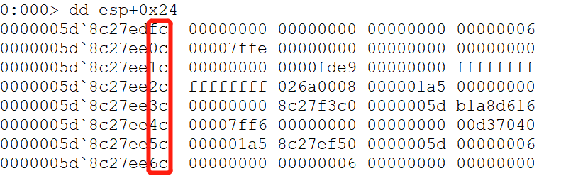
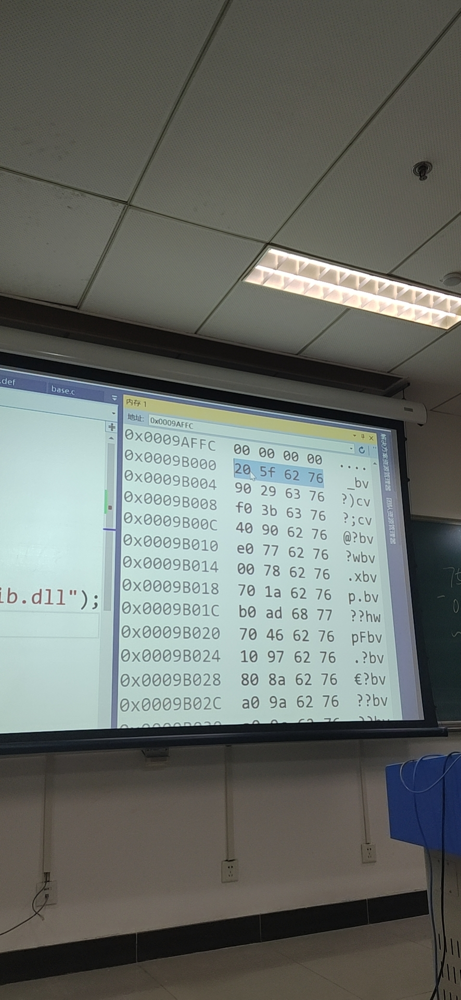

# 2019.9.10
## 基本
微软sdl软件项目安全开发生命周期  
开发过程：需求分析、设计、开发、测试  
测试时有很多安全原则，比如：  
strcpy可能会有溢出，其中一个原则是不使用非安全函数  
测试阶段一定要进行安全性测试，比如Fuzzing测试  
  
看软件工程的书

## 什么是软件工程

CPU ：硬件（有物理实体）  
OS  ：硬件（就是数据、文件）  
APP ：软件发展的阶段：指令->函数（软件的优势：可复制、可复用）->改造CPU成一个能理解高级动作的执行器，此时执行的叫基于虚拟机的APP,而CPU执行的叫原生APP。

* 作业要求:  
          1.Git提交，要学一遍，git clone http:...  
          2.提交的是地址，git log提交记录，git log 越丰富分数越高；git diff比较版本

技术：工具、格式、标准、方法

# 2019.9.17

编译器cl(windows)clang(linux)gcc将.cpp变成.exe的过程叫编译链接

0x80~0xFF没有对应的可显示的字符和符号，文本文件包含的是可打印字符，二进制文件包含00~FF的二进制数。

为什么要有编译和连接？程序的执行靠CPU，逻辑电路靠电平的高低来控制，

安全研究两大方向  
二进制安全，研究原生程序的安全，比如缓冲区溢出等，操作系统，计算机体系结构，二进制指令了解深入  
网络应用的安全（通常是脚本写的应用程序）数据泄露，逻辑校验不完整，较多是逻辑问题，跨站脚本攻击，通过提交框（例如微博评论）注入一段代码到网页，浏览器以为是提交的代码而不是用户评论，会自己执行，这可能会使用户密码等泄露，xss（跨站脚本攻击）

做实验：Http html 爬虫的编写 抓包器和协议解析

# 2019.9.18

clang 完成了编译链接两步的工作，.c-->.o编译-->.exe链接，多个.o形成exe，其中包括lib文件，lib文件包含多个api，这样的exe叫原生应用程序netive app,所有的脚本运行都必须使用原生应用程序的解析器来运行（比如python.exe,java.exe,浏览器等）。 


原生应用程序的特点：解析代码并直接运行、性能最好、开发相对较难  
原生应用程序开发难的原因：一般使用c/cpp的指针内存要深入理解，以及原生API多且杂    


要看的书：深入理解计算机系统、Unix环境高级变成、windows系统核心编程  

  ## 看原生应用程序  

  看二进制：windows---winjex,linux---bash 
  看反汇编也可看二进制：dumpbin objdump

## http以及html

从下到上：硬件（CPU、内存）---OS---原生APP(Chrome)三大基础功能：http client网络功能（从srv【服务器】上拿到html文件）、html的解析与显示，也叫渲染（标签化）、执行脚本（通常是网页相关的处理的过程，尤其是用于交互数据以及动态效果），因此是一个脚本执行器

google V8 Webkit脚本解析，我们可以做的是网络功能以及html解析，因此我们写爬虫，比价网，反爬虫（反爬虫），爬虫做游戏外挂

## 爬虫

header字段通常是浏览器的类型和版本，如果不设置，服务器可以根据你的请求而过滤掉，比如一看是python request的库，header是为了伪装成浏览器发送的请求。

socket编程，tcp以下的已做好

response=request.get返回的是state,200正常,404,403没有访问权限，500服务器内部崩溃，因此应该判断

response.content可以保存成文件，然后可以打开

lxml里面的存储结构etree，etree有很多不同的解析方法，比如Html,json,html.xpan的方法通过路径的方式定位tree中的元素，//div表示所有的div标签前面可以是任意，//div[class='']可以定位属性，还可以调用函数获得标签内部的内容，html/body/div是前面要具体的路径

$x('')xpath命令

# 2019.9.24

进入仓库，先设公钥
ssh-keygen -t ras -b 4096
putty windows的终端
有了公私钥以后不需要用户密码来登陆

     1、打开git bash
     2、执行生成公钥和私钥的命令：ssh-keygen -t ras -b 4096（为什么按三下，是因为有提示你是否需要设置密码，如果设置了每次使用Git都会用到密码，一般都是直接不写为空，直接回车就好了）。会在一个文件夹里面生成一个私钥 id_rsa和一个公钥id_rsa.pub。（可执行start ~ 命令，生成的公私钥在 .ssh的文件夹里面）
     3、执行查看公钥的命令：cat ~/.ssh/id_rsa.pub  

python -m pip install selenium requests lxml
包名错误或者网速太慢，如果网速慢就需要使用国内包的源（直接搜索python源）  
pythpon -m pip -i 连接
[更改国内镜像源，提交下载速度](https://blog.csdn.net/lambert310/article/details/52412059)
当我们的工程量大，写一个requirements.txt写入所有需要的包名，vps安装 
python -m pip -r requirements.txt一次性安装

接续lxml调用GDI的库进行渲染

爬虫设计数据提交，需要登陆

防火墙穿透
五元组
设置一些过滤规则
有一张可以用美元的信用卡、去国外买一个vps linode.com,在C上架一个代理服务器，A上的代理设置成C，A-C必有加密通道，到C解密，异或最简单，shadowsocks部署一个server，防火墙是黑名单规则
隧道，gotunnel，异或进行端口转发
elem_user=self.driver.find_element_
秒传是哈希值
selenium提供统一的接口，chromedriver,firefoxdriver
$x('//a[@class="left_tab_core"]')

找一个有用户提交以

有用户登陆功能，用户信息提交，并且能呈现给其他用户
跨站脚本执行，也就是如果用户提交的如果有脚本，但是没有过滤，就会被执行，一个商品表，一个评论表，用户Id表，时间，用户有一个编辑框，输入后，数据进入数据库
有一个有跨站脚本漏洞的程序,并成功利用这个漏洞

写一个爬虫，自动提交和验证网页有这样的漏洞，看页面会不会执行我提交的脚本，判断是否有漏洞

# 2019.10.8
xss  
用户A提交了脚本给server，用户B会执行这个脚本
假的登录弹窗，数据提交到A的后端，为什么？
在server端严格校验用户提交的数据中是否有可被执行的程序，因此一个好的网站应该对用户的提交进行过滤
sql注入  
 
argc表示Main()命令行参数的个数  
argv表示运行程序时用来存放命令行字符串参数的指针数组  
我们在敲命令行其实就是在向命令行工具的代码传入参数    
变量定义是为了告诉编译器要分配空间来存储变量  
java\python自己能判断变量需要多少的存储量，而C语言必须明确地告诉需要多少存储空间,c语言没有那么智能，strcpy传入的是指针，如果写入越界，可能会覆盖内部控制数据，
    
    #include<stdlib.h>
    #include<stdio.h>
    #include<string.h>
    int sub(char* x)
    {
	    char y[10];
	    strcpy_s(y, strlen(x), x);//拷贝目的地址，大小，拷贝的源，这个大小是为了判断大小是否越界，因此应该判断的是y的大小
	    return 0;
    }
    int mian(int arge, char** argv)
    {
	    char y[10];
	    if (arge > 1)
	    {
		  strcpy(y, argv[1]);
	    }
    }

* 属性--C/C++--代码生成：如果关闭了安全检查、基本运行时检查就不会给出错误信息，直接报错。  

如何从可执行文件中去恢复参数，push用来传参，call返回地址，从上到下：局部变量，返回地址，参数
缓冲区溢出及漏洞利用程序

漏洞库集：
[CVE](http://cve.mitre.org/?_blank)
[CNNVD](http://www.cnnvd.org.cn/blank) 
[CNVD](https://www.cnvd.org.cn/)

web程序的基本框架:html
一开始有一个服务器，httpserver的搭建，httpserver是一个程序，最著名的httpserver是httpd,启动，netstat去看一下端口的占用情况，启动之前和启动之后的80端口，前为关闭状态，后为监听状态，httpd在主机上有一个目录，可以放到任何一个有html的文件夹中，httpd 127.0.0.0 \a html就可以看这个网页中的信息，先取数据，根据Html渲染，执行脚本。

安装http server ，还可以进行抓包，这是一个静态的web服务器，实际生活中的是一个动态的网站，静态网站和动态网站最大的区别在于，每一次的Html都是有数据支撑新生成的（数据库）,一开始是C语言编程的，cgi，就是printf的结果重定位到http server上

Http server 有哪些

php非常适合处理web

写一些动态的脚本，php做一个乘法器，php get的全局变量

一个思维习惯：不要做重复性的工作，前人已经做过的工作就不需要再去做了，封装和复用，你做的东西要有接口，别人通过接口就能简单实用  

web开发的流程：  
用户提交的一般两种方式，get和post,后端处理，DB访问拼接回Html,通常返回Html\json\xml的数据，很多东西是重复共性的，那么别人就解决了共性问题的东西叫框架，flask\django,django是mvt的模式，也有mvc(model\view\control)模式，m是数据模型（数据库表结构），v就是功能列表，t页面模板决定最后用户看到是什么样子，每个应用这三个都不一样，关注不同进行开发，框架也进行了一些基础的安全处理。  
核心：定义数据模型、编写功能列表、定义页面模板

* 关系型数据库：数据表存储具有相同属性的对象，两张表存储，最好是引用另一张表的id，这个就叫做外键，不可重复的作为主键，二维数据一维化，这时候就会有多个外键，比如订单表存储的是商品和用户的外键。

先开发数据模型（查询的sql语句是需要拼接的），在进行网页开发（每个功能设计一个页面的模式，请求的地址）

两周学完django  
用django做东西有一个基础的orm，不必关注底层是怎么做的，只需要做到定义类，框架自动将类中的数据映射到表结构当中，以后要用的时候引用数据库的对象

抓包器抓一下整个响应的过程  
用httoserver建立一个web程序执行的过程，写一个简单的Php,返回显示在页面上，动态生成页面，pho调用数据库的裸操作
用框架构建一个web应用  
php用lera  
Python 用flask和django  

# 2019.10.22
1. 一定要学的东西：  
  1.git和github的使用，pro git,看官方文档  
  2.markdown可对比，版本化管理，格式简洁化     
  3.原生应用程序（.c/.cpp编译链接成的exe||.c/.cpp/golang编译链接成的elf）和web（网络）应用程序  
2. 机器指令二进制，汇编是文本，机器指令与汇编一一对应，执行的是机器指令，机器指令到汇编的过程叫汇编，反之反汇编  
3. 程序执行过程，如何观察？调试器（debuger）看EIP  
4. 调试器：  
  1.VS自带的/工业级：windbg,gdb,vc,gnu  
  2.编译连接器（或两大平台）：  
    a.vc的在windows开发的完整工具链在vs总，cle,link,sdk等  
    b.gnu有gcc\libc\gdb  
  3.调试基本操作：断点、单步、反汇编、内存、寄存器
    * .c/.cpp源文件与汇编对应关系
5. 缓冲区溢出漏洞
  
       #define _CRT_SECURE_NO_WARNINGS

       #include <stdlib.h>
       #include <stdio.h>
       #include <string.h>

       int sub(char* x)
       {
        char y[10];
        strcpy(y, x);
        return 0;
        }

       int main(int argc, char** argv)
       {
        if (argc > 1)
        sub(argv[1]);
        printf("exit");
       }
       * 要存入ebp-main用于ret的时候回退

* c/c++直接和内存打交道，malloc动态显示声明，全局变量或局部变量隐式声明，编译器进行分配，尽量少使用全局变量，局部变量的效率很高  
* c语言面临的是平坦的内存空间，需要数据结构来组织数据，首先要知道底层数据的组织，二进制和缓冲区的错误主要是在数据组织上，web程序是逻辑性问题，没有考虑到用户输入的恶意性。
* 堆溢出漏洞，堆和栈是两种数据管理模型，堆对应着malloc和free，程序要处理数据，一开始无法预计所需要的存储空间有多大,malloc和free就满足需要多大分配多大，程序执行的时候可以多次Malloc，以及多次不定时free。有一个内存使用的双向链表，而这个链表本身也需要使用内存。malloc产生的是数据在前，头在后面，头会根据操作系统的版本而不一样，因此不同的版本链表头不一样。
* 代码没有问题，但是内存会崩溃，释放时内存崩溃可能是前面溢出了，崩溃之处并不是产生问题的地方。前[地址]+4写入后，因此导致了可以向任意地址写入任意信息，free没有数据抹除，而是将指针脱链

参数每四个字节都不一样

写了一段代码没有调用，如何执行？？？

# 2019.10.29

C语言没有解决内存的问题；.net提供了类和接口的方式，专注于应用；python和java主要解决了社会化协作问题，创造了很多基础程序库，库非常丰富，有包管理器；  
对于做安全的同学一定要深入底层，C语言没有被淘汰是因为基础软件必须使用C语言来开发，python\net\java的执行器都是用C语言开发的  
技术本身没有好坏，研究技术和工具  
做一个小的外挂，当所有计算结果为999时，将结果改成666，通过windg来调试，exe调用API来做基础的功能(可能是TextOut()属于GDI图形用户库，形成控件，将一个文字显示在界面上，printf的底层就可能调用的TextOut,有道词典的屏幕取词就是重载TextOut,每一次会存取当前页面的内容，当指到某一处的时候，就会知道所指的内容是什么)

老师发的.md里面的东西都要会，腾讯玄武实验室  
任何时间有任何问题，随时提问  

多线程与虚拟内存管理
进程创建和动态链接
[createthread](https://docs.microsoft.com/en-us/windows/win32/api/processthreadsapi/nf-processthreadsapi-createthread)
远程线程注入技术是什么？？？
程序的运行必须创建进程，那么可以看到异常的，可以把我们的
一定要看的书：unix环境高级编程和windows核心编程和深入理解计算机系统和[inter手册](https://software.intel.com/sites/default/files/managed/39/c5/325462-sdm-vol-1-2abcd-3abcd.pdf)
华为鸿蒙，兼容安卓的API，现在是操作系统适应应用程序  
线程是进程的执行流程
所有的函数，都是Main主线程调用createthread函数创建的进程
## 2019.12.13
WINDBG:独立的调试工具，能够对windows下用户态或者内核态程序进行调试，常用于逆向工程以及内核驱动、服务的开发。  
键盘记录器，vs也可以远程调试  
[安老师课件](anjingcuc.github.io/courses-wiki)
* 早年的windbg很小，现在包含到了windows sdk中，需要下载windows sdk镜像仅选择安装windbg，tom keepper,腾讯玄武，于洋  

可以写调试脚本，动态修改调试的对象和寄存器的值
双击以后没有反应，开始程序当中会出现windows kits，打开。  
左上方windbg:10.0.18362.1是windows sdk 的版本，在'项目'---'常规'---'windows sdk'中可以选择版本，尽量一致  
打开执行文件  
release没有符号文件，debug虽繁没有符号信息，windg.pdb文件记录了所有的信息，比如偏移，符号文件  ，因此不能上传pdb这些可以生成的东西
左下角指示器，指示当前在哪一个进程/线程。旁边是输入框，输入命令  
调试的时候需要额外的东西：源代码和符号文件
记住断点的函数的名字，bu命令，bp，bu告诉你可以在某一个函数上下断点，g f10  
winfbg可以调试操作系统的各个组件，比如计算器，windbg可以列出所有的函数，然后下断点

* 早年windows的符号文件可下载，现在是实时获取========

'bu WinDBG!main'--'g'---'F10'
#### 调试计算器
打开calc.exe  
从\\server实时拉取文件，存到\symbols文件夹下  
.symfix C:\symbols---本地缓存的目录 
* .symfix+ C:\symbols1----在刚刚的目录上加一个目录  
* .sympath默认的参数是srv*,会根据你已经加载的符号文件实时加载
* 有界面的是winmain,没有界面的是main
bu notepad!WinMain #不会有任何的报错，  
g #弹出计算器，加载了所有的动态文件  
lm #列出所有的模块  
发现运行成了Notepad
x calc!*查看所有的函数，文件中看到应该是wWinMain
bu wWinMain  
g  
无论存什么，存到记事本上，都显示成被黑了----是更改了writefile的函数
## 实验要求
每当运行结果为999时显示为666
## 实验思路
SetWindowTextW函数下断点，需要知道SetWindowTextW是哪一模块
## 实验过程

* 失败是因为使用的是win10是uwp格式，应用商店下载的.net开发的，因此不可以用来调试
# 2019-12-10
windbg脚本 
WinDBG 命令
命令窗口是 WinDBG 的一大特色，命令窗口中我们可以使用类似 cmd 中的快捷键来编辑、重复或者取消各种调试命令。WinDBG 命令的详细说明请参考调试器命令。
方向键 ↑ / ↓ 来翻看之前输入的命令。
BACKSPACE / DELETE / INSERT / ← / → 来编辑。
ESC 清空本行命令，CTRL-BREAK 终止当前命令执行。 
u 查看后续的n条指令  

## 表达式[微软官方文档](https://docs.microsoft.com/zh-cn/windows-hardware/drivers/debugger/using-debugger-commands)  
windbg能够处理两种类型的表达式masn表达式和c++表达式，默认情况下windbg会将表达式作为masm表达式  
* .expr /s masm/c++可以更改表达式的格式，使用过程中是两种表达式交替的
.expr 可以查看或修改当前的默认表达式处理器  
?? Expression 命令，Watch 窗口，Locals 窗口使用 C++表达式处理器。
部分扩展使用 MASM 表达式处理器。
如果表达式被括号括起来并且前面有 @@ 符号，那么将使用非默认表达式处理器。
其他情况下，都使用默认的表达式处理器。
## 数字
在没有前缀的情况下，数字可以使用 n (Set Number Base) 来指定基数；同时还可以使用前缀 0x 表示十六进制数，0n 表示十进制数，0t 表示八进制数，0b 表示二进制数。还可以使用 .formats ((Show Number Formats) 来查看一个数字的多种进制表示。
* n 默认是16;n 10得到结果是10;.formats 0xFFFFF
## 符号
总的来说，符号在两种不同的表达式处理器中表示的内容不同，符号以字母、下划线(_)、问号(?)或者 dollar 符号($)开头。
MASM 中，符号表示的都是地址，可以是全局变量地址、局部变量地址、函数地址、模块地址，总之都是地址。
C++ 中，符号表示的是它相应的数据类型，比如整型、结构体、函数指针等 C++ 中的数据类型。
## 别名 (Aliases)
在 WinDBG 命令中，对于一些可能反复输入的较长的指令，我们可以为他们取别名。别名由别名名字(alias name)和别名等价式(alias equivalent)两部分组成，
* WinDBG 支持三种别名：用户自定义别名。固定别名：$u0 - $u9。调试器自动设置的别名
* 固定别名不可以改名字，但是可以给它赋值或等于一个表达式
### 用户自定义别名
类似我们编程定义变量并赋值一样，自己定义别名名称并同时设置好别名等价式即可。使用 as 或者 aS 设置别名，ad 删除别名，al 列出已经定义的别名。
别名名称应该是一个不包含空白字符的字符串。
别名等价式可以是任意字符串，比如内存值、表达式、某文件的内容等等
* as demo 5+1，再.echo demo看到结果5+1，不会运算，加参数/x可以得出结果，即as /x demo 5+1[as\AS设置别名](https://docs.microsoft.com/zh-cn/windows-hardware/drivers/debugger/as--as--set-alias-)
### 固定别名
固定别名共有 10 个：$u0 - $u9。固定别名的等价式应该是不包含回车的任意字符串。使用 r 命令来定义固定别名。
* 访问的过程类似访问寄存器
* r $.u0=5+1再.echo $u0得到结果5+1
### 调试器自动设置的别名
$ntnsym
NT 符号在系统原生架构中对应的模块，一般等于 ntdll or nt。
$ntwsym
在 WOW64 上进行 32 位调试时，NT 符号在系统原生架构中对应的模块，一般为 ntdll 或者其他 32 位的ntdll。
$ntsym
根据当前机器模式，找到 NT 符号对应的模块。一般与 $ntnsym 一致。
$CurrentDumpFile
调试器最后加载的 dump 文件名。
$CurrentDumpPath
调试器最后加载的 dump 文件所在路径。
$CurrentDumpArchiveFile
调试器最后加载的 CAB 文件名。
$CurrentDumpArchivePath
调试器最后加载的 CAB 文件所在路径。
* 解析dump文件可以解决为什么蓝屏了，漏洞在哪里
* .echo $ntsym得到ntdll说明ntsym对应的是ntdll的动态链接库
### 用法
别名在执行时为被自动替换为其等价式，但是别名比如和其他命令文本用空格、分号或者引号隔开。如果必须和别的命令文本连起来使用，则需要用 ${} 这种形式展开。
aS /x myAlias 5 + 1; .block{.echo myAlias}
* .echo demo ---得到demo的结果，而${demo}展开demo的结果
* 可以把指令写入txt，再引进windbg
* process monitor查看进程调用的api
由于之前bu kernel32!writefile下断点打开exe没有断电反应，说明dll可能有错
* process monitor 过滤出notepad.exe，找到writefile 'stack'中找到'KERNERLBASE.DLL'
* windbg的restart按钮，保留历史命令重新启动。
#### 写入内容打印出'hello'
打开的是windows下的notepad.exe
bu kernelbase!writefile ".echo hello;g"---bl查看断点
.echo hello;g
保存文件看到有'hello'打印出
* windows目录下有一个notepad.exe，windows/system32目录下也有一个
bu kernelbase!writefile "$><脚本文件的路径记得要\\"---下了一个断点，会导入一个脚本文件，并执行脚本文件的命令--bl--g--

## 以下是五种导入文件模式

* <不会对脚本进行修改，如果<>都有就会把命令缩在一起，如果脚本有参数>a<
## 调试命令编程基本元素
调试脚本由控制流指令以及调试命令组成，控制流指令相当于其他高级语言中的控制语句，比如 .if / .while / .for 等等，代码块使用 {} 包裹，如果单纯的想要构建一个代码块且不适用任何控制语句，那么需要用 .block{} 的形式。脚本中可以使用别名、伪寄存器等来作为局部变量，还可以加入注释 $$ 开头即可。
## 语法规则
默认情况下调试脚本采用 MASM 的语法规则，如果要加入 C++ 相关内容，则使用 @@c++() 语法。字符串比较的操作使用 MASM 中的 $scmp / $sicmp / $spat 等函数实现，具体函数说明参考官方文档。
* 可以字符串比对等等
### 第一个实验失败
dd 61000 L4---查看内存61000后4个地址中的内容，内容再赋给value，对value进行操作  
第一个实验失败是因为有些指令访问内存需要权限，而当前我们没有权限
```
#示例脚本
.foreach (value {dd 61000 L4})
{
   as /x ${/v:myAlias} value + 1
   .block{.echo value myAlias}
}

ad myAlias
```
### 第二个实验成功
bu kernelbase!writefile "$$<C:\\Users\\karen\\Desktop\\a.txt"
记事本中输入123456保存变成hacked
```
#示例代码
as /mu content poi(esp+0n24)
.block{.if($scmp("${content}","123456")==0){ezu poi(esp+0n24) "hacked";}.else{.echo content}}
g
```
代码分析：poi(esp+0n24)访问该地址中的值，因为是unicode的字符串所以使用/mu的参数，content表示要写入文件的内容；.block{}使得content的内容能够被正确地展开；ezu 目标 内容，将目标改成内容
* 为什么地址是esp+0n24[msdn writefile function](https://docs.microsoft.com/en-us/windows/win32/api/fileapi/nf-fileapi-writefile)查看writefile function的参数，注意参数在内存中是从右向左存，然后我们调试文件看到的

* 64位的机器内存中每行8位，32位的每行4位  
完成win7上调试计算器
 # 2019.12.16
 脱离调试器，也能实现软件的篡改和攻防，核心技术叫程序的注入技术，用一个程序来篡改另一个程序的行为，有一个攻击者程序，用攻击者来改变被攻击者的行为，相当于被劫持了。  
 进程是所有的程序执行的时候，系统的一个管理对象，是程序运行时，非运行时就是静止的文件。今日的操作系统都是用进程的管理方式。举一反三。  
 [Taking a Snapshot and Viewing Processes](https://docs.microsoft.com/zh-cn/windows/win32/toolhelp/taking-a-snapshot-and-viewing-processes)  
 假设是在写一个游戏或者计算器的外挂，运行完以后要知道当前要攻击的目标是否存在，找到攻击的目标，因此，遍历当前系统当中的所有进程    
 snapshot拿到进程链表的链表头，把节点一个个给遍历出来，以及每个进程的模块和线程的数量。为了保证接口的延续性，process32first是64位保留32位的命名方式。'PROCESSENTRY32'操作系统保存的进程信息是以结构体保存的，包括比如进程ID，进程当前线程的数量，父进程的ID，进程名等等，任务管理器中的PID是进程ID。
 
* [const char *类型的实参与tchar类型的实参不兼容](https://blog.csdn.net/Roy_Yuan_/article/details/80718550)---或者从.cpp改成.c就行，是因为编译器不同  

对比：.cpp文件，任务管理器和cmd中tasklist命令  
创建了进程先不要退出，有可能单线程程序也会得到四个线程，因为现在最少得到最少内核的数量，是系统设置，需要验证  
模块是exe或者dll文件，是一个可执行文件，第一个模块一定是exe，而且有且只有一个exe，有若干个dll，kernek32.dll含有很多基础API，dumpbin命令的使用，会发现dumpbin一个exe的dll，都会出现在Modules里面，而且一些没有的也在Modules里面，模块就是程序中共用的一些东西.dll中的api是很多可执行程序共用的，exe的执行需要dll的支持。  
模块注入技术---dll注入技术，效果：给一个已经存在的程序注入一个原本不应该有的程序，实现一些意想不到的功能。  
什么是动态链接库？  
动态链接库[dlls](https://docs.microsoft.com/en-us/previous-versions/visualstudio/visual-studio-2008/1ez7dh12(v=vs.90))  
工程属性中有一个链接器，dll有一个链接的概念。链接的动态和静态的区别？链接的概念：是把若干个程序的组成部分拼接在一起形成一个整体，这个过程叫链接。  
举个例子，以下会报错LINK2019,
```
int main()
{
	sub();
}
```
但是,以下可以成功
```
int sub()
{
	return 0;
}
int main()
{
	sub();
}
```
如果a.c中
```
int sub();
int main()
{
	sub();
}
```
b.c中
```
int sub()
{
	return 0;
}
```
进入.c文件所在的路径
编译链接，发现a.exe可运行
如果b.cpp变成
```
#include<Windows.h>
int sub()
{
	MessageBox(0, "this is msg", 0, 0);
	return 0;
}
```
```link a.obj b.obj /out:hehe.exe```会报错'无法解析的命令'  
找到增加函数的模块
```link a.obj b.obj User32.lib /out:haha.exe```不再报错
dumpbin haha.exe 多了一个模块  
程序是拼接而成的    
静态链接：源代码所需的指令位于可执行程序的内部，相对静止，静态链接编译成功只生成一个.lib文件  
动态链接：代码不在可执行程序的内部，代码在不同的可执行文件里面，需要执行的时候imports，位置不相对静止，动态链接编译成功产生一个.lib文件和一个.dll文件    
通常自己写的程序静态链接，而我们用的exe就是动态链接的方式，调用系统的api    
dumpbin /exports导出dll的内部函数，函数名前面是函数的地址，也就是exe要调用的时候通过导出表找到函数；/imports导出的是导入到可执行文件中的函数和模块，说明可执行程序调用了哪些模块的哪些函数。  
``` dumpbin /exports C:\Windows\System32\User32.dll >C:\Users\karen\Desktop\try.txt```
* 在编译源文件时，C编译器和C++编译器都会对符号(函数或变量)名作某些修正，但两者采用的修正方法不同，所以两者生成的目标文件不能互相链接。把c的代码放到.c文件中，把c++的代码放到.cpp文件中。
dll文件叫加载。exe文件叫运行  
Linux系统中有一个.so文件相当于windows的.dll文件，如果是静态链接，那么就要放在可执行文件中，比如printf，是经常被使用的，一方面浪费空间，可执行文件会非常大，不易升级和维护，因为可执行程序依赖于基础程序，二如果printf有bug，那么就需要之前有printf的可执行文件全都升级一遍，但是如果单独放在一个文件里面，就只需要改文件，因此模块化，第三个作用：开发了一个基础平台，基础平台很牛，不给你源代码，但是又希望在此平台上开发，起到了闭源系统依然可以开放的功能。  
作业：  
下两个工具，Process manager sysinternals下载process explorer,exe调用Dll,dll又调用Dll,如果说是依赖，那么会有依赖树。[dependency walker](http://dependencywalker.com/)看dll的调用，
综合使用今天源代码中的模块遍历，结合三个工具，dumpbin,process explorer,dependency walker，都有查看可执行程序所依赖库的功能，结合分析，比较结果  
### dll注入
dll从哪里来？如何自己编写一个Dll,为什么自己编写？万一哪天我们自己开发一个平台，比如一个算法库（神经网络算法库）。对于做软件安全的人，dll是一个攻击的工具与，用这个工具来篡改其他程序的行为，比如攻击calc.exe最直接的方式就是在它里面注入一个dll，运行起来以后，利用dll进行功能篡改或者是数据的窃取。  
如何自己写一个dll,当我们写好一个dll以后，如何用dll进行攻击  
选中模块右键'属性'---'链接器'---'输入'---'模块定义文件'
[Module-Definition files](https://docs.microsoft.com/en-us/cpp/build/reference/module-definition-dot-def-files?view=vs-2019)
[Exporting from a DLL using](https://docs.microsoft.com/en-us/cpp/build/exporting-from-a-dll-using-def-files?view=vs-2019)  
cl /c只编译不链接
```
link base.obj /out:base.dll /dll /def:expt.def
#会报错
link base.obj User32.lib /dll /def:expt.def
#看到生成dll文件
dumpbin /exports base.dll
#看到lib_dunction
```
或者：选中项目右键，配置属性--常规---配置类型：动态库，连接器---输入---模块定义文件--输入expt.def，看到调试生成的结果中有dll和lib，由于上方导入expt.def以及写了kernel32，因此不需要我们再写。
新建项目，链接Lib,运行用Dll
所有导出函数在def文件中，命令行编译为dll文件，编译链接器会自动生成Lib文件,dll文件lib文件头文件放在一个目录下，目录加入include的环境变量中，就在写exe时，就可以include<>,并调用封装好的dll中的函数。核心：def文件，link /dll /def 选项，为了方便调用，增加头文件，连接的时候，连接玩保证exe和dll在同一个目录中，或者放到系统目录中去
link app.obj ..\base\base.lib /out:app.exe  
第一种：local time
link lib
imports table
第二种：run time---使用函数指针
[参考资料：Using RUn-Time Dynamic linking](https://docs.microsoft.com/zh-cn/windows/win32/dlls/using-run-time-dynamic-linking)
函数指针:像指针一样地调用函数  
作业：1.会编写dll，把.c文件，编译为obj文件，把obj文件和Lib文件链接为新的dll和lib文件，2.编写一个exe，调用第一个生成的dll文件中的导出函数，注意使用def文件定义导出函数，方法是：1.link时将第一步生成地Lib文件作为exe的输入文件2.保证dll文件和exe文件在同一目录，或者dll文件在系统目录3.第二步的调用方式称为load time，特点是exe文件由导入表中会出现需要调用的dll文件名及函数名，并且在link生成exe时需明确输入lib文件，还有一种调用方式，称为run time,调用dll的导出函数，包括系统API和第一步自行生成的dll,都要能成功调用  
可以用def文件，也可以函数
# 2019.12.23
dll注入
遍历进程、openprocess、
下载执行，可以进行全盘磁盘加密，
两种典型的攻击行为：1.下载执行2.
如何去做防御，Apihook
## run-time
-  LoadLibrary
  ```c
  HMODULE LoadLibraryA(
    LPCSTR lpLibFileName    // 模块名
    );
  ```
- [Dynamic-Link Library Entry-Point Function](https://docs.microsoft.com/zh-cn/windows/win32/dlls/dynamic-link-library-entry-point-function)
  - 将`DLLMain`放入`base.c`
  - 在`DLL_PROCESS_ATTACH`下添加一行`lib_function("loaded");`
  - 只要 DLL 加载就会调用
```c
#include<Windows.h>

// 数据类型，定义函数指针类型
typedef int (WINAPI* MY_PROC)(char*);

int main()
{
	// 获得模块句柄
	HMODULE hBaselib = LoadLibraryA("baselib.dll");

	if (hBaselib == NULL)return 0;

	// 获得函数指针
	MY_PROC func = GetProcAddress(hBaselib, "lib_function");
	func("run time load");	// 函数指针变量和函数的使用方法相同
}
```

- `GetProcAddress`：`Retrieves the address of an exported function or variable from the specified dynamic-link library (DLL).`

## 使用动态链接库进行攻击

- hacker 编写 DLL(恶意代码) 注入 正常程序(victim)
- DLL 加载顺序：当前路径 -> 系统路径
- DLL 劫持：当前目录下放 kernel32.dll 调用系统目录下的 kernel32.dll

- https://github.com/fdiskyou/injectAllTheThings
- `CreateRemoteThread()`远程创建线程，如进程A为进程B创建线程：Creates a thread that runs in the virtual address space of another process.
- `Process32First`和`Process32Next`遍历当前操作系统当中的所有进程
- 通过进程名获得 PID
- 作业
  - 查文档，研究远程线程方式注入dll的实例代码的实现原理
  - 运行实例代码，向一个目标程序（比如notepad.exe)注入一个我们自行编写的dll，加载运行
  - 整合进程遍历的程序，使得攻击程序可以自己遍历进程得到目标程序的pid

```c
#include <stdio.h>
#include <Windows.h>
#include <tlhelp32.h>
#include "fheaders.h"

DWORD demoCreateRemoteThreadW(PCWSTR pszLibFile, DWORD dwProcessId)
{
	// Calculate the number of bytes needed for the DLL's pathname
	DWORD dwSize = (lstrlenW(pszLibFile) + 1) * sizeof(wchar_t);

	// Get process handle passing in the process ID
    // 如若权限不够，使用管理员权限运行
	HANDLE hProcess = OpenProcess(
		PROCESS_QUERY_INFORMATION |
		PROCESS_CREATE_THREAD |
		PROCESS_VM_OPERATION |
		PROCESS_VM_WRITE,
		FALSE, dwProcessId);
	if (hProcess == NULL)
	{
		wprintf(TEXT("[-] Error: Could not open process for PID (%d).\n"), dwProcessId);
		return(1);
	}

	// Allocate space in the remote process for the pathname
	LPVOID pszLibFileRemote = (PWSTR)VirtualAllocEx(hProcess, NULL, dwSize, MEM_COMMIT, PAGE_READWRITE);
	if (pszLibFileRemote == NULL)
	{
		wprintf(TEXT("[-] Error: Could not allocate memory inside PID (%d).\n"), dwProcessId);
		return(1);
	}

	// Copy the DLL's pathname to the remote process address space
	DWORD n = WriteProcessMemory(hProcess, pszLibFileRemote, (PVOID)pszLibFile, dwSize, NULL);
	if (n == 0)
	{
		wprintf(TEXT("[-] Error: Could not write any bytes into the PID [%d] address space.\n"), dwProcessId);
		return(1);
	}

	// Get the real address of LoadLibraryW in Kernel32.dll
	PTHREAD_START_ROUTINE pfnThreadRtn = (PTHREAD_START_ROUTINE)GetProcAddress(GetModuleHandle(TEXT("Kernel32")), "LoadLibraryW");
	if (pfnThreadRtn == NULL)
	{
		wprintf(TEXT("[-] Error: Could not find LoadLibraryA function inside kernel32.dll library.\n"));
		return(1);
	}

	// Create a remote thread that calls LoadLibraryW(DLLPathname)
	HANDLE hThread = CreateRemoteThread(hProcess, NULL, 0, pfnThreadRtn, pszLibFileRemote, 0, NULL);
	if (hThread == NULL)
	{
		wprintf(TEXT("[-] Error: Could not create the Remote Thread.\n"));
		return(1);
	}
	else
		wprintf(TEXT("[+] Success: DLL injected via CreateRemoteThread().\n"));

	// Wait for the remote thread to terminate
	WaitForSingleObject(hThread, INFINITE);

	// Free the remote memory that contained the DLL's pathname and close Handles
	if (pszLibFileRemote != NULL)
		VirtualFreeEx(hProcess, pszLibFileRemote, 0, MEM_RELEASE);

	if (hThread != NULL)
		CloseHandle(hThread);

	if (hProcess != NULL)
		CloseHandle(hProcess);

	return(0);
}
```

- 典型攻击行为
  - 下载执行
  - 勒索软件
# API hook
达到的效果：记事本写入哈哈哈，保存的时候变成呵呵呵，常用的有外挂，notekit,篡改杀毒软件来规避杀毒软件对我们的查杀。对软件行为的篡改就叫api hook，hook翻译成中文叫挂钩，实际上就是说，把系统的api的函数替换为一个伪造的函数，从而实现对系统行为的监控和修改。  
动态链接，当可执行程序在调用系统为我们调用的系统函数的时候对我们函数进行查找和发现的行为。  
加入代码，加断点，调试，转到反汇编，去掉符号名
api函数的地址，这个表就是导入表，存着的是所有调用的api的地址，使用peexplorer.可执行文件是以一定的格式组成的，具有一定的结构
解析PE文件的工具：
```
xxd loader.exe
dumpbin /headers loader.exe
```
[PE Format](https://docs.microsoft.com/en-us/windows/win32/debug/pe-format)1970年的1月1号的0：0：0到现在的时间怎么计算的？先HEX再DEC位置是固定的，但是值是遍的，每次加载函数的位置都不一样。动态链接的过程要在程序运行前确定.左边一列永远不变右边一定会变
既然结构公开，通过导出表和导入表，编一个程序解构PE文件，来找到系统函数来保存文件的地址，可以把真实的地址改成假的地址，一般也不会去检查地址，call过去运行的程序就被劫持了，就运行了假函数，用户还以为功能是正常的。IAT hook就是替换ipa表中原本真实函数的地址，使得程序在调用系统函数的时候调用了一个假函数。从而达到篡改的目的。
hook writefile，调用writefile，先要createfile，使得每次写文件，如果文件内容是啊哈哈哈改成呵呵呵，验证hook是否正确。把hook，writefile的功能写成dll注入到Notepad类似的进程当中进行hook。find dirstfilefirst find firstnect注入到cmd当中去，输入回车dir时，只要出现hacker.exe，就不要让这个结果出现，实现文件的隐藏，就是实现杀毒软件无法遍历到这个文件。用进程的遍历，让taskmanager遍历不到hacker.exe。Textout这样的函数，可以记录屏幕上内容，实现屏幕取词。金山游侠是外挂的鼻祖。Chrome的屏幕取词无法实现是因为渲染引擎不是GDI，不是Textout。还能接管其他进程的键盘输入，注入到微信的进程当中，读取文本框的内容，然后发走。
线程注入技术和IAT HOOK技术对一个进程的行为篡改。