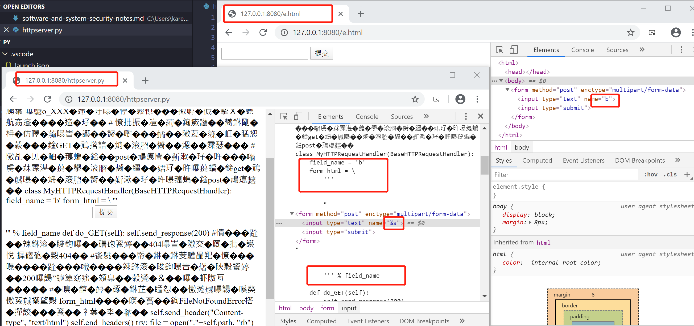
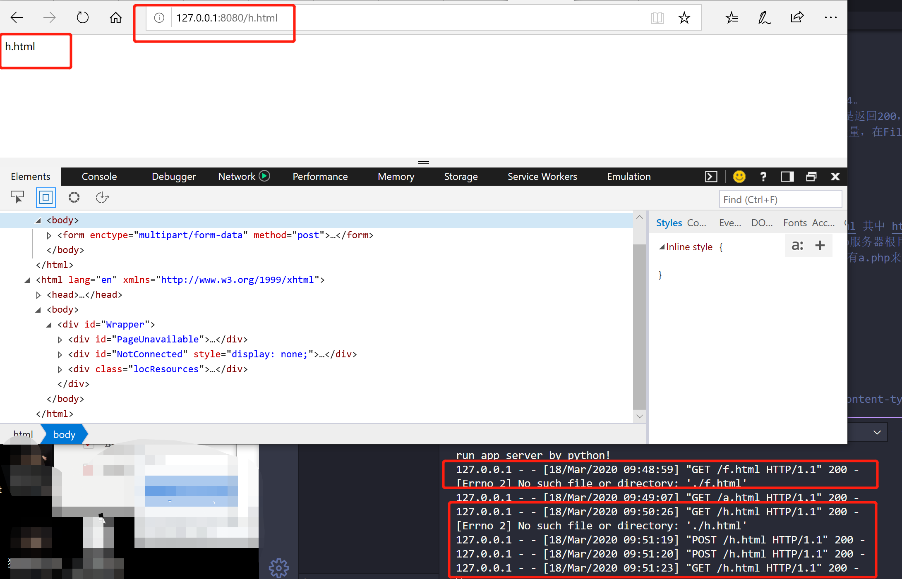
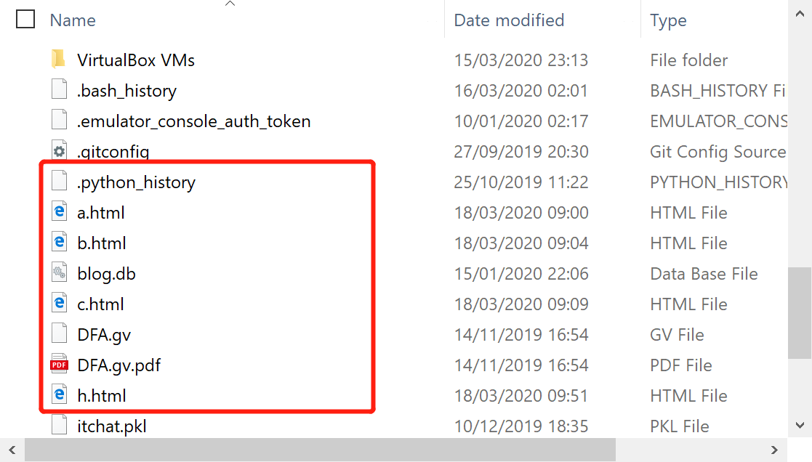
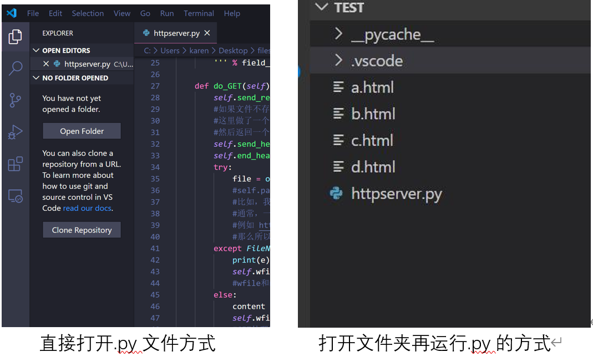
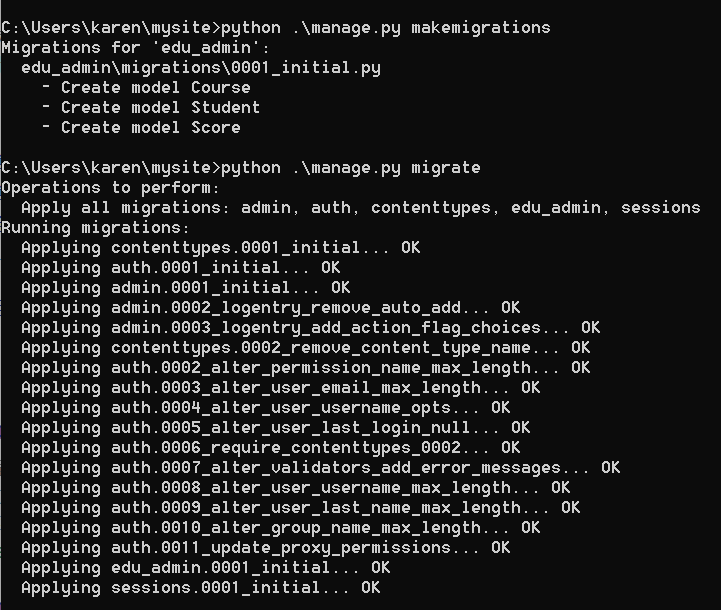
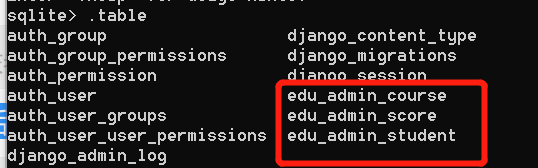
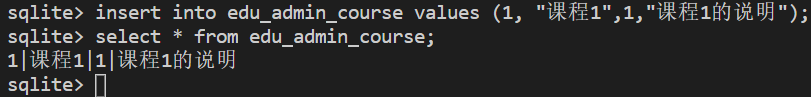

# 软件与系统安全学习笔记
按照[课程网站](http://programtrace.com/)清单上检测自己的能力。
* mspaint.exe是画图软件
* 学习了二维码制作
* 出于好奇网站的搭建，找到了[linux用户-个人网站快速搭建过程](https://cuijiahua.com/blog/2018/10/website-20.html)以及[WordPress博客网站的教程](https://www.zhihu.com/question/21535441)再或者[使用宝塔面板和Wordpress搭建独立网站](https://www.zhujibiji.com/2018/04/how-to-use-bandwagonhost-build-a-website/)，但是都只大致看了一遍，了解了一些东西，还没有实操解决。
## 课程总述
软件安全概括为三个方面：
1. 是有什么安全问题，安全问题产生的原因。   
分为两个方面：   
1）【二进制方面】：主要是内存相关问题和逻辑错误问题。有明确的机制，比如缓冲区溢出，空指针，格式化字符串。逻辑错误：多种多样了。  
2）【Web方面】：典型安全问题：xss\sql注入等。非典型：代码的逻辑错误，每个漏洞都可能有不同的原理。
2. 如何去发现问题，如何发现安全漏洞。  
漏洞挖掘技术：分为白盒分析和黑盒分析。  
【白盒分析】就是通过分析软件的源代码去寻找问题。这里面，有手工代码分析，就是我们的软件测试技术，和代码review。但是软件的源代码通常比较庞大，手工分析起来很费劲。所以，又有人研究如何自动化的分析代码。典型的技术呢，就是符号执行。  
【黑盒分析】就是完全不管软件的内部机理，不去看源码，把需要分析的软件当做一个黑盒子。看不见或根本不去看内部，从表面现象进行分析。对软件来说，就是看输入和输出。给它什么样的输入，得到什么样的输出，再去猜测他内部的机制，根据表面现象来分析。黑盒分析法，典型的就是Fuzzing技术，中文叫模糊测试。

3. 如果有人利用这些安全问题，如何防御。  
补丁：软件由于复杂性，不可能没有问题，只要发现了问题及时修补就是好样的。经过多年的发展，大家终于形成了一套行之有效的方法。就是通过漏洞数据库来披露和管理各种漏洞，厂家有义务定期发布软件补丁或者更新，软件用户应该及时升级软件。第三方人员，如果发现了安全问题，应该通报给厂家，而不是在漏洞修补以前，去利用漏洞搞破坏，或者不负责任的披露漏洞。  
但是呢，难免会有人就是要利用这些漏洞。所以在其他方面，也需要防御机制。如何去寻找记录攻击的痕迹，然后分析这些数据。数据的来源又分为了【主机层面】和【网络层面】，这就是我们入侵防御系统所做的事情。  
攻击的人会进行伪装，不让防御的人那么容易发现，攻击者可能会做哪些方面的伪装，常用的伪装技术有哪些，如何去对抗伪装，也是我们这个课的内容。这方面，典型的技术就是加壳脱壳技术，和Rootkit技术。


## 第一方面
重点：缓冲区溢出和xss，这两个也代表了二进制软件和脚本软件（包括绝大多数Web软件都是脚本软件开发的）两大技术方向。

* 计算机科学的特点就是，越底层的东西，越难。开发操作系统比开发app难多了。

二进制软件和脚本软件的区别：  
二进制软件：计算机的底层，是CPU直接执行在内存中的机器指令，C和C++这类编程语言开发的软件，有一个过程，叫编译链接，其实就是为了把程序变成CPU可以直接执行的二进制指令。这类软件的一个特点，就是需要直接操作内存。内存是所有在运行态的软件及其数据保存的地方。内存分为细小的单元，每个单元有一个唯一的地址。所有要访问数据，必须知道数据的地址，要保存新的数据，就必须分配内存，获得可用的地址。那么地址也是数，如果搞不好，不小心，计算错误了。那么就会访问到不该访问的数据，就会造成数据的泄露或者破坏。这就是二进制软件安全问题的根源。二进制程序的编程，有很大的难度，就在于CPU只能做出这样了，他是电路，是物理的东西，不可能设计得机制太复杂。使用C语言和C++就不可避免的一个东西：直接操作内存，也就是指针。然后在C和C++发展成熟以后，就有人去研究如何降低编程的难度，可不可以避免程序员编程时直接操作内存，把需要操作内存的地方，都封装起来。屏蔽在编程语言的内部。就发明了脚本语言。  
脚本语言：是干脆用C和C++这样的二进制程序开一个软件来执行一种新的程序。也就是用软件来模拟CPU工作。但是软件的可定制性比CPU就高多了，可以想定义什么指令就定义什么指令。把所有需要操作内存的东西，全部封闭在执行器内部，只给程序员接口，不给程序员操作内存的机会。这就是对象。比如把字符串封装为string对象。只能调用string.len()这样的方法来操作这个对象。这样就避免了由于编程不慎造成的内存相关问题。也降低了编程难度。所有大家看到python java js这样的程序，都有一个二进制程序的执行器。比如python.exe java.exe Web浏览器等。这些脚本程序的执行器，都是二进制程序。  


### XSS
xss的由来：  
虽然这些脚本程序没有了内存相关问题，有引出了其他的问题。事物总是复杂的。比如XSS的问题。就是web程序，存在一种高交互性。web是互联网时代的软件的基本框架，所以一定会有用户提交数据。当初为了网页动态的需求，开发了网页的前端脚本，比如js。直接把脚本嵌入到网页中。浏览器只要发现了script标签，就去当做脚本来执行。把网页按照程序员的定制，变的丰富多彩，变得富于变化。但是，恰恰另外一种需求，就是UGC软件，所谓用户产生内容。也就是网页的内容来自于用户提交的内容，这种软件已经非常常见了。比如BBS、博客、微博，电商视频网站的用户评论，都会涉及到用户提交的内容在页面上呈现。这两种机制，放在一起就产生了神奇的效果。当用户提交的内容里含有脚本呢？如果直接将用户提交的内容放在页面上，那么用户提交的内容中的脚本会不会被浏览器解析执行呢？那么一个用户提交了一个脚本就可以在这个页面的所有用户主机上执行呢？用户能提交程序执行了，怎么才能不保证这个程序不是恶意的呢？要知道，前端脚本，除了渲染页面元素这样的功能，还有获得用户的输入跳转页面到其他地址等等丰富的功能。
* 只有能执行，就能干很多事情。

#### xss实验  
实验原理提示  
1. 首先，你需要学习编写一个简单的html文件，这个文件只要有一个表单，用户就可以在表单中输入数据，向服务器提交。手写一个这样的网页大约只需要一分钟。
```
<html>
<body>
<form method="post">
        <input type="text">
        <button>提交</button>
      </form>
</body>
</html>
```
2. 下面呢，搭建一个web服务器，再有一些简单的处理过程，就可以重现xss了。  如果这个html是放在web服务器上，用户输入了数据，点击提交，浏览器就会把编辑框中的数据封装为一个POST请求，发给服务器。服务器会把这个数据发给后端脚本来处理。你可以通过定义 from的属性来指明需要哪个脚本文件来处理。比如PHP程序，他有一个POST超级变量，当用户提交了数据以后，对应的php脚本的post变量就是用户提交的数据。
3. 假设服务器现在把用户提交的数据放在user_input.html的body标签中。然后保存在服务器文件的根目录中。当有网站的用户访问http://xxxx.com/user_input.html的时候。就会看到刚才哪个表单用户提交的内容。当然实际的情况是这两个用户可能不是同一个用户，于是A用户提交的内容B用户就访问到了。当服务器脚本是原封不动的把用户输入的数据写到html里是，如果用户提交的数据中包括script标签，就会被执行。然后需要简单的学一下js语言。比如alert函数，弹出一个消息框。既然能执行alert函数，就能执行其他功能，比如给 window.location.href
赋值，让用户莫名其妙的跳转到另外一个网站。  
最简单的实验环境，就是在vscode中，安装一个php插件，然后编写一个简单的php脚本，调试运行这个脚本。F5 vscode会自动选择脚本运行的方式 ，把用户的表单输入写入到html文件。在通过浏览器访问这个文件html文件，这就是一个最简单的xss运行环境了。  
实际的XSS漏洞可能很复杂，比如还会有数据库啊，登录啊。等等，但是万变不离其宗，基本原理都是这样。  

[我的完成](https://github.com/Calistamu/Software-and-system-security/tree/master/test0x01-xss)-POST超级变量的思路
* 如果html出现乱码，在<head>标签中通过meta指定，是网页编码问题

#### 老师的演示

使用python最基本的http 服务器的方式。代码具体如下：
>files/httpserver.py

[http请求的多种methods](https://developer.mozilla.org/en-US/docs/Web/HTTP/Methods)  

```
# -*- coding: utf-8 -*-

import sys
import cgi
from http.server import HTTPServer, BaseHTTPRequestHandler


class MyHTTPRequestHandler(BaseHTTPRequestHandler):
    field_name = 'a'
    form_html = \
        '''
        <html>
        <body>
        <form method='post' enctype='multipart/form-data'>
        <input type='text' name='%s'>
        <input type='submit'>
        </form>
        </body>
        </html>
        ''' % field_name

    def do_GET(self):
        self.send_response(200)
        self.send_header("Content-type", "text/html")
        self.end_headers()
        try:
            file = open("."+self.path, "rb")
        except FileNotFoundError as e:
            print(e)
            self.wfile.write(self.form_html.encode())
        else:
            content = file.read()
            self.wfile.write(content)

    def do_POST(self):
        form_data = cgi.FieldStorage(
            fp=self.rfile,
            headers=self.headers,
            environ={
                'REQUEST_METHOD': 'POST',
                'CONTENT_TYPE': self.headers['Content-Type'],
            })
        fields = form_data.keys()
        if self.field_name in fields:
            input_data = form_data[self.field_name].value
            file = open("."+self.path, "wb")
            file.write(input_data.encode())

        self.send_response(200)
        self.send_header("Content-type", "text/html")
        self.end_headers()
        self.wfile.write(b"<html><body>OK</body></html>")


class MyHTTPServer(HTTPServer):
    def __init__(self, host, port):
        print("run app server by python!")
        HTTPServer.__init__(self,  (host, port), MyHTTPRequestHandler)


if '__main__' == __name__:
    server_ip = "0.0.0.0"
    server_port = 8080
    if len(sys.argv) == 2:
        server_port = int(sys.argv[1])
    if len(sys.argv) == 3:
        server_ip = sys.argv[1]
        server_port = int(sys.argv[2])
    print("App server is running on http://%s:%s " % (server_ip, server_port))

    server = MyHTTPServer(server_ip, server_port)
    server.serve_forever()
```

* 代码讲解如下：  
使用python原生的cgi和http.server两个库运行的一个简单的http服务器程序。
61行，是程序入口。55行MyHTTPServer类，是继承自原生的HTTPServer。重写了 init函数，增加了打印输出语言，然后字节调用父类的 init 传递了服务器运行需要的地址、端口等参数。监听地址和端口是 0.0.0.0:8080
MyHTTPRequestHandler 类，这个是 HTTPServer 的回调。用来处理到达的请求。.0.0.0:8080 上有任何的HTTP请求到达时，都会调用 MyHTTPRequestHandler来处理。
MyHTTPRequestHandler 直接 继承自 BaseHTTPRequestHandler，其中 
8-52：BaseHTTPRequestHandler 的 do_GET和do_POST两个方法被重写。在 python 的 BaseHTTPRequestHandler 类中 ，do_XXX函数，就是处理对应的客户端请求的函数（浏览器所发送的数据包里包括请求类型， 在http 的headers里，会说明方法）。这个HTTP请求的处理类是整个代码的主体，也是出问题的地方。
http请求有很多种，我们通常使用得最多的，是GET和POST。大家直接在浏览器中输入链接，浏览器拿到地址以后，默认是采用GET方式向服务器发送请求。
代码14行，这里的表单是使用的post方法提交数据。通常来说，从服务器获取数据，使用get方面，向服务器提交数据，使用post方法。
所以在 58行指定了 MyHTTPRequestHandler 来处理 http请求，那么当用get方法请求，就会调用 do_GET,POST方法请求，就会调用 do_POST函数。这是python最基本的http 服务器的方式
27，self.path 是这个请求的路径。这里的 http://127.0.0.1:8080/a.html 其中 http://127.0.0.1:8080是协议服务器地址和端口。/a.html就是路径。通常，一个静态的http服务器，这里的路径就是http服务器根目录下的文件，动态服务器这里可能是文件和参数，或者是对应其他服务器后台的处理过程。通常，一个静态的http服务器，这里的路径就是http服务器根目录下的文件，动态服务器这里可能是文件和参数，或者是对应其他服务器后台的处理过程。指定有a.php来处理这个请求，参数是p1=x。问号后面是参数，可以有多个。那么所以我们就去读 a.html文件。
一般来说，如果文件不存在，应该返回什么？404。23行那个 self.send_response(200)200按照协议 应该是404。这里做了一个特殊的处理，如果指定的文件不存在，我还是返回200，表示请求路径是正确的，可以处理，然后返回一个默认的页面。这个页面就是 form_html的变量，在FileNotFoundError异常处理过程中写回。wfile和rfile对应http响应和请求的body部分。GET处理完成以后，浏览器就拿到了 200 状态的 "Content-type"为"text/html"的 form_html。
打开浏览器的调试模式，chrome在菜单-更多工具，开发者工具里面。到sources这个tab就看到了服务器向浏览器返回的数据，就是我们的form_html变量，这一段 html 浏览器渲染出来，就是那个带一个编辑框的表单。表单指定了使用post方式向服务器提交数据。network tab里可以看到完整的请求响应过程。
在表单中填入数据。点提交按钮。然后服务器的do_POST函数回被调用。这里通过 cgi.FieldStorage解析了客户端提交的请求，原始的请求的头部在self.headers。body部分在self.rfile。解析完成以后放到 form_data变量里，其中form_data['field_name'].value，就是你在编辑框中填入的数据。通常，一个服务器会根据业务逻辑处理用户提交的数据，比如用户发表的商品评论，你们在我的在线教学系统中填入的作业，一般会写入数据库，但是这些数据，在某些情况下又会被显示出来，比如我批改你们的作业，其他用户看你的商品评论的时候。我们这里为了模拟这个过程，简化了一下，没有用户系统，也没有数据库。直接写入了文件。而且是写入path对应的文件。如果写入成功，就返回一个200状态的OK。在 49-52行返回。44-47行处理了用户提交，写入文件。
如果这时大家提交了一个 123，这里获得是，对应的是form中input的name，15行，表单以变量名变量值的方式组织，input的name相当于变量名，你填入的数据就是变量值。python的cgi.FieldStorage将form组织为python的dict数据类型，所以可以通过  form_data['field_name'].value 获得所填入的数据。如果填入了 123 那么123被写入了a.html文件，执行完成后，你的目录下会多一个a.html，内容为123，然后你下次再访问 http://127.0.0.1:8080/a.html 时，在浏览器地址栏里回车。由于这个时候a.htm已经存在了所以是运行的31-33行的else部分，直接把文件内容会写给浏览器，这里时在简化模拟用户提交数据-存入数据-其他用户获取这个数据的过程。这里有就XSS漏洞了。下面大家再访问一个不存在的页面，比如b.html，又会出现那个默认的form。如果这时我们输入，```<html><body><script>alert('XSS')</script></form></body></html>```，这段内容就会被写入b.html，然后在访问b.html的时候，整个页面被载入 script在浏览器上执行。理论上，任何的js都是可以被执行的。js可以实现非常丰富的功能。比如可以让你扫码支付等等。这么复杂的功能我们不演示了，反正大家理解是可以实现的。下面我们稍微改一下。比如在 c.html里填入，```<html><body><script>window.location.href='http://by.cuc.edu.cn'</script></form></body></html>```，下次再访问c.html的时候。页面跳转了。这就是 ```window.location.href='http://by.cuc.edu.cn' ```这段脚本的功能。比如有一个商品A，你在评论里输入了一段js代码。如果服务器不做处理直接保存。后面的的用户访问商品A是，看评论，你输入的代码就会在其他用户的页面上执行。比如骗去用户支付，实际到账你的账户。
 下面还有更严重的漏洞，如果大家在浏览器中访问，```http://127.0.0.1:8080/httpserver.py```，由于服务器没有做任何过滤，只要是存在的文件，就发送给客户端，源代码文件也发送给了客户端。现在黑客可以知道我整个后台的逻辑了。如果还有一些配置文件，比如数据库地址和访问口令等。那就更严重了。
* 更严重的是，黑客甚至可以注入后端代码。由于我们是回写到文件，你可以构造一个http post请求，把httpserver.py文件改写了。但是构造这个请求用浏览器就不行了，需要采用curl等更基础的工具裸写post请求发送给服务器的.所以我们需要把input的name改为a,把 name="%s" 改为 name="a" 再提交,httpserver.py，它变了。所以，我们甚至可以给后端注入代码。如果只是注入一个hahaha 服务器就挂了。再也跑不起来了,因为他不是一个可以运行的python,这是一个及其简单，但是漏洞百出的web服务器。  
对于这一步，其实为什么这么做，我有了新的理解，如下图所示，因为httpserver.py多了引号，浏览器没有正常识别到field_name的值，因此input name的值为%s，当点击的提交的时候，提供给了(%s,xxx)这样的键值对，所以需要更改为a，而为什么智能改成a呢，因为Post里面对键值对处理有要求。如果改成的值和fiels_name的不一样，那么其实存储了但没能正确识别。


* vs vode直接打开文件运行与打开文件夹运行的区别  
[我的csdn文章](https://editor.csdn.net/md/?articleId=104938833)（当初迷迷糊糊的自己多么愚蠢）：  
对于之前的演示的a.html我还是能够访问到，并且我重新实验了一次，比如提示了h.html，提示没有此文件，但是依然创建了文件，输入了内容后，依然能够访问h.html

如果不是打开文件夹的方式，并不是凭空存储的，是默认保存在了我设置的python的工作路径下，因为正好有一个.python_history来记录，那么中间文件就会出现在与.python_history同级的目录下。

如果是打开文件夹的方式，那么所有结果输出和中间文件都会出现在所打开的文件夹下。  
而且二者在vs code上查看到的目录结构不一样，如下图。


页面刷新和重新输入网址跳转：  
先来说“刷新”，它是在你现有页面的基础上，检查网页是否有更新的内容。在检查时，会保留之前的一些变量的值，因此有可能会造成刷新后网页出现错误，或者打不开的情况；“转到”和在地址栏回车，则相当于你重新输入网页的URL访问，这种情况下，浏览器会尽量使用已经存在于本机中的缓存。也就是说，“刷新” 是取网页的新内容来更新本机缓存，在更新的同时保留之前的一些变量；“转到”则是一种全新的访问，它会尽量使用本机缓存中的文件，但不会保留之前的变量

### web程序开发和web程序非常常见的一种漏洞-sql注入

#### http和html的基础知识 
首先，客户端（浏览器）和服务器要区分清楚。用户使用浏览器访问服务器，服务器在云端，我们看不见，只有一个域名对应的IP地址。浏览器通过发送请求到服务器，服务器收到请求以后返回响应。这里面数据的发送和接受，底层是计算机网络的东西的工作。对web程序来说，主要关心就是这一收一发的过程，Requests and responses 。
* 这里面，大家一定要做的一个实验，就是使用抓包器，去抓取一次web访问过程中的数据包，分析一下Requests and responses 数据的数据包格式。可以看到在tcp数据包的payload部分是http协议数据包，又分为了headers和body等部分。
然后发送的Request，最核心的部分是一个url。就是大家通常说的网址。其中/前的部分，是主机地址，会被解析为ip地址。第一个/后的部分为路径和参数。会对应服务器上的文件或者功能。然后，服务器处理完毕了，返回response，而response一般是一个html格式的文本。浏览器，会直接把html渲染为我们所看到的页面的不同样式。html有自己专门的语法。又可以嵌入js和css，用来要求浏览器执行动态的效果，或者根据css的配置，对各种html的内部的标签和元素，显示不同的样式。html的格式是以标签树的结构组织的。学习html和js最好的工具就是chrome的调试模式。
* 这里有第二个大家必做的实验，就是用chrome的开发者工具的 elements、sources和network几个工具，分析网页。

#### web程序开发的基本过程
框架：上周给大家演示的程序使用python内置的库开发了一个基本的http服务器端。涉及到了 刚才说的Requests and responses html 表单 get post url等基本概念了。现在的web程序一般都比较复杂，会使用数据库。而且一般会有很多功能和页面。为了方便web程序的开发，大家发明了一种开发web程序的基础架构。就是把web程序开发的一些底层的东西，已经处理好了。开发者只需要关注功能的构建就可以了。是现在主流的开发技术，称为框架。各种web后端编程语言，比如java、php、python都有自己的框架。其中大家最熟悉的python现在最火的框架是Django，然后是flask。
##### 以django为例，web开发的主要流程
[安装 django ](https://docs.djangoproject.com/en/3.0/),以下[官方文档教程四个命令](https://docs.djangoproject.com/en/3.0/intro/tutorial01/)，构建了一个基于Django的基本框架的web应用程序。然后访问 'http://127.0.0.1:8000/'，可以看到结果:  
* 如果pip安装速度很慢，大家可以修改pip使用的镜像源，改为国内的源，速度就会很快，比如我图里使用的aliyun的镜像。
```
# 下载安装Django
pip install Django```或```python -m pip install Django
# 四个命令，构建了一个基于Django的基本框架的web应用程序
django-admin startproject mysite
cd  mysite
python manage.py startapp polls
python manage.py runserver
```
在命令行里，可以看到服务器的打印输出，表示服务器收到了 request。大家看到的页面就是框架自动返回给大家的response。说明，request和response，请求相应的处理过程已经搭建起来了。
#### 做一个简单的教务管理系统
mvc:  
教务管理系统肯定要用到数据库了。我说一下Django框架的基本编程的结构。其他的框架也差不多。在大一的时候，给大家介绍过mvc的概念。编写大型程序的时候，一定要做到mvc分离，m数据模型，我们要先建立基础的底层的数据结构。然后在处理用户输入，构建每个用户输入对应的处理函数。就是c 控制。然后，在底层m数据模型的基础上，绘制用户界面。比如写贪吃蛇游戏，最先做的事情，使用链表来保存蛇和食物的相应的数据，写一些处理这个数据的函数，供上层的c和v来调用，我们把这个叫做封装。这是基本的编程思想，和正确的工作组织流程。大到一个复杂的大型web程序，其实底层思想还是mvc。  

mvt：  
只是换了个名字，叫mvt，t是页面模板。  

写Django的程序，或者任何框架程序。主要就是写三大部分：  
第一，数据模型，models，第二，views和url。是用户请求对应的处理程序。第三，前端页面模板。处理完的结果如何显示的问题。其中url部分，又称为路由。是把用户请求的url，对应到处理函数的过程。Django的处理函数，有一个专门名称，叫views。其基本过程就是框架收到用户的request ，其中有URL。框架根据urls.py中的配置。将用户请求对应到一个处理函数。一般在views.py中。views.py中的函数，参数就是request对象，Django中是HttpRequest类。然后views函数需要返回一个HTTPResponse类型的request，Django把这个reqeust变化为http协议的request数据包，返回给浏览器。一般在views的处理过程中，会访问数据库，也就是models。models吧底层的数据库操作，比如sql全部封装为了对象化的处理。比如底层操作数据库是用sql语句，这个大家在数据的课程中学习过。所以我们最原始的web程序，一般会程序员拼装sql语句。但是在Django中不用。我们把这种底层数据的封装，称为orm（Object-relational Mapper）。

框架：框架第一，把web开发流程变成了mvc结构。第二，提供了非常多丰富的web开发过程中需要使用的库。框架处理了最基本的请求响应过程。把请求映射到了处理函数，程序员就不用管很多麻烦的底层过程。只需要专心业务逻辑的处理。  

使用数据库，现在我们使用的数据库分两种，一种叫关系型数据库，一种叫非关系型数据库。其中教务系统这种信息管理类的软件，一般是使用关系型数据库。关系型数据库的基本结构是表。那如何体现“关系”呢？关系其实是指表与表之间的关系。首先就是设计数据库表结构，一个教务系统，最少需要三张表：学生信息、课程信息、选课信息。
```
# 建一个app：edu_admin
python manage.py startapp edu_admin
```
修改表结构：替换edu_admin中models.py，内容如下：
```
from django.db import models
from django.contrib.auth.models import AbstractUser

class Course(models.Model):
    name = models.CharField(verbose_name='课程名', max_length=100)
    number = models.IntegerField(verbose_name='编号', default=0)
    summary = models.CharField(verbose_name='摘要', max_length=500, null=True)

class Student(models.Model):
    class_name = models.CharField(verbose_name="班级", max_length=100, blank=True, null=True)
    name = models.CharField(verbose_name="姓名", max_length=100, blank=True, null=True)
    number = models.IntegerField(verbose_name="学号", default=0)
    phone_number = models.CharField(verbose_name='手机号', max_length=11, null=True)

class Score(models.Model):
    course = models.ForeignKey(Course,verbose_name='课程', on_delete=models.CASCADE, related_name='students')
    student = models.ForeignKey(Student,verbose_name='学生', on_delete=models.CASCADE, related_name='my_courses')
    score = models.FloatField(verbose_name='成绩', null=True)
```
我们需要把这个表结构，真实的写入到数据库中。也就是create table的过程。django称为migrate。打开 mysite的settings.py，在  INSTALLED_APPS 这里增加一个 edu_admin[官方添加方法](https://docs.djangoproject.com/en/3.0/intro/tutorial02/#activating-models)，表示 edu_admin 这个是我们这个site的一个app，之前startapp命令只是创建了app，必须要把app写入到这里，这个app才会被纳入到站点功能中。
```
python .\manage.py makemigrations
python .\manage.py migrate
```
效果如下图

然后会出现一个 db.sqlite3文件数据库表结构就建立完成了。Django这里默认使用了sqlite这种简单的文件型数据库。settings里加app,加了才会有刚才建的表.Django这里默认使用了sqlite这种简单的文件型数据库。这种数据库的好处是不用按照，就是一个文件来保存数据的所有信息，适合轻量级小规模的应用。但是效率和容量都有效。一般用在开发调试环境，不用在生产环境。加了app以后，执行makemigrations和migrate。makemigrations成功的标志是在app的目录下有migrations目录。  

为了验证Django真的建立了表，我们去下载一个sqlite的客户端软件，来看一下它的表结构。[Windows的同学，下载sqlite-tools-win32-x86-3310100.zip](https://www.sqlite.org/download.html),Linux的同学直接 apt install sqlite3。把这个exe加入在PATH环境变量，或者放在db.sqlite同一个目录,然后```sqlite3.exe db.sqlite3```进入到sqlite的命令行以后 执行 ```.table```。然后可以看到所有的表,如下图所示

这三个表是我们在models中定义的。其他表是Django自己要用的。然后大家可以执行sql语句，插入一条记录。insert和select可以成功。如下图所示，说明表是好的。


然后我会说sql注入的基本原理。然后再给大家分析一下sql注入和xss在django框架下是如何被解决的。