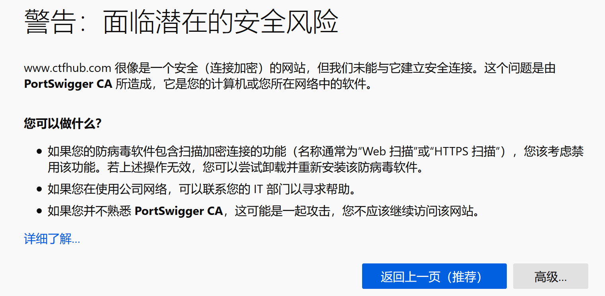
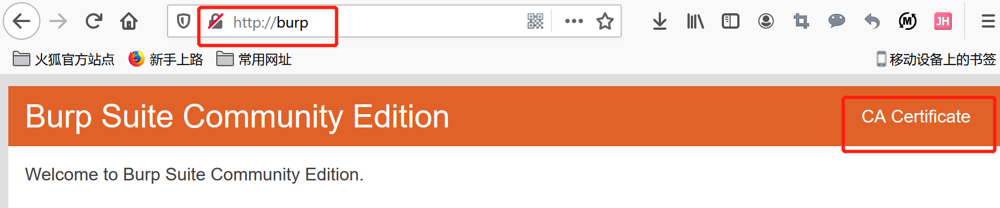
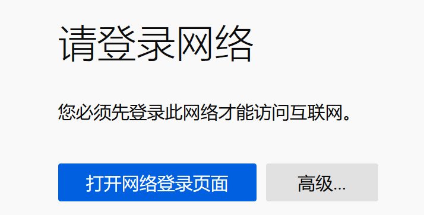
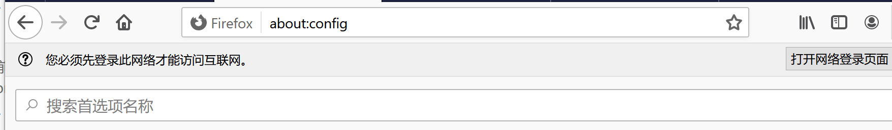
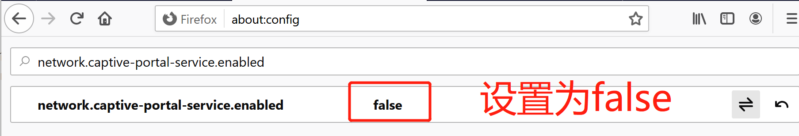
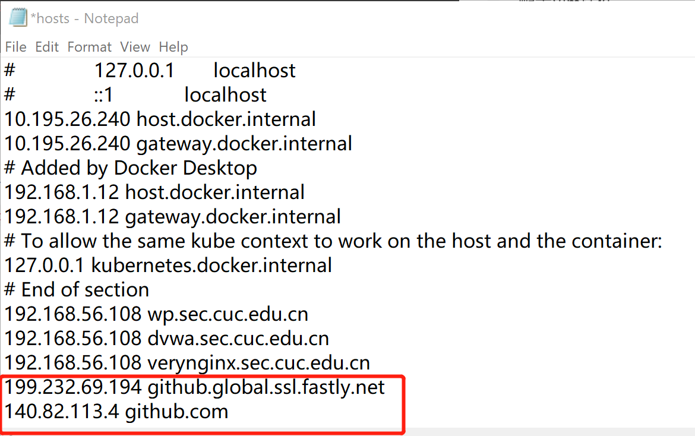

# 学渣的自我修养(与日俱进)

## 2020.6.10
2020.6.10之前，学习了:二维码+python的itchat库+python的turtle库。
今日学习：了解了csp认证和codeforces+上了"腾讯犀牛鸟t-star"比赛第二课
### 二维码  
[二维码](https://zh.wikipedia.org/wiki/%E4%BA%8C%E7%B6%AD%E7%A2%BC)和[条形码](https://zh.wikipedia.org/wiki/%E4%B8%80%E7%BB%B4%E6%9D%A1%E7%A0%81)的[区别](https://blog.csdn.net/dcrmg/article/details/52106805)  
* 二维码是一个总的概念。常见的二维码有：PDF417码、汉信码、颜色条码、[QR码](https://zh.wikipedia.org/wiki/QR%E7%A2%BC)  

[二维码、QR码、DM码的区别](https://my.oschina.net/jeffzhao/blog/104854)  
[二维码的生成细节和原理](https://coolshell.cn/articles/10590.html)  
二维码制作  
[word制作二维码](https://zhuanlan.zhihu.com/p/55545264)、[excel制作二维码](https://zhuanlan.zhihu.com/p/30831696)、各种编程代码制作二维码([python动态二维码制作](https://blog.csdn.net/qq_40733911/article/details/81087595?depth_1-utm_source=distribute.pc_relevant.none-task&utm_source=distribute.pc_relevant.none-task))、软件制作二维码、[草料二维码网站动态二维码制作](https://zhuanlan.zhihu.com/p/34125837)以及别的在线生成器  
[动态二维码与静态二维码的区别](https://blog.qrstuff.com/2012/08/12/dynamic-qr-codes)  
[动态二维码](https://www.qr-code-generator.com/qr-code-marketing/more-information-more-flexibility/)与动图二维码不同

### python-itchat
完成了微信自动回复和机器人聊天  
[仓库地址](https://github.com/Calistamu/wechatrobot)  
[图灵机器人](http://www.turingapi.com/)  
### python-turtle
可以自动画图，保存了一个自动化小猪佩奇的代码。  
>code/peggi.py

## 2020.6.13
今日学习总结：  
* utools
* emoji
* 语雀
* daygram
* 科学上网
* sqlmapK
* win10手势
* 玩转vs code
* zoomit
* 规则引擎
### utools
[utools官网](https://u.tools/)    
学习文章：[黑科技神器-uTools](https://www.cnblogs.com/goodAndyxublog/archive/2020/03/14/12490721.html)
* 比[wox](http://www.wox.one/)+[everything](https://www.voidtools.com/)或者Alfred插件更多，性能更好，平台跨越更宽，更方便快捷
* 了解到emoji插件，拓展学习[Markdown玩转Emoji](https://www.jianshu.com/p/e66c9a26a5d5)  
总结：  
首先vs code要下载相应插件    
表情获得：[emoji-cheat-sheet](https://www.webfx.com/tools/emoji-cheat-sheet/)，但是utools可以立刻获得:grinning:  
#控制尺寸  
代码块中增加：print(":grinning:")

### 语雀
[语雀官网](https://www.yuque.com/)   
[使用手册](https://www.yuque.com/yuque/help/)
* 我用过的笔记：  
印象笔记(收费)  
onenote(windows用户)  
有道云笔记(跨平台、同步方便，免费) 
* 语雀不支持手机
* 支持历史版本，对于附件和第三方服务更方便，比vs code编写markdown更方便


### daygram
用过很多的日志记录软件，最喜欢这款，极简方便。安卓免费。

### 科学上网
[fanqiang](https://github.com/bannedbook/fanqiang)

### sqlmap
python编写的sql注入工具。[sqlmap](https://github.com/sqlmapproject/sqlmap)
### win10手势
[适用于 Windows 10 的触摸板手势](https://support.microsoft.com/zh-cn/help/4027871/windows-10-touchpad-gestures)
### 玩转vscode

#### 快捷键：  
* ctrl+P:  
1. 弹出搜索栏，直接输入关键字，在所有文件中搜索特定符号
2. 搜索栏前输入”@“，在当前文件中搜索特定符号 
3. 搜索栏前输入”>“，搜索所有可使用的命令
#### 插件：
* Auto Close Tag---自动闭合html标签
* Auto Rename Tag ---修改html标签时，自动修改匹配的标签* * Code Spell Checker ---单词拼写检查
* Copy Relative Path ---获取文件相对路径
* Bracket Pair Colorizer ---使用颜色标识匹配的括号
* GitLens --单击代码行就可以看到编辑它的人，时间，提交的内容
* Code Runner ---代码片段运行调试，支持多种语言
* Remove Comments ---一键删除当前文件的注释，支持40多种语言
* Image preview ---实现图片预览功能；
* [powermode](https://marketplace.visualstudio.com/items?itemName=hoovercj.vscode-power-mode)---敲字特效
#### git+vs code
[Git version control in VS Code](https://code.visualstudio.com/docs/introvideos/versioncontrol)
### zoomit
[ZoomIt v4.5.2](https://docs.microsoft.com/en-us/sysinternals/downloads/zoomit)  

### 规则引擎
大创开发的时候了解到规则引擎：ckrule和drools。知识有了理论认知，没能实现

## 2020.6.15

### git写博客
* 还可以用gridea
本次学习使用了[hexo](https://hexo.io/)  
* 参考[超详细Hexo+Github博客搭建小白教程](https://zhuanlan.zhihu.com/p/35668237)及各个官方文档
1. 仓库准备

github与本地连接

```
# git has been installed
git config --global user.name "你的GitHub用户名"
git config --global user.email "你的GitHub注册邮箱"
ssh-keygen -t rsa -C "你的GitHub注册邮箱"
# 打开GitHub_Settings_keys 页面，新建new SSH Key
# 在Git Bash中检测GitHub公钥设置是否成功，输入ssh git@github.com
```

github建仓库

* 仓库名称一定是：用户名.github.io

* public+travis+initialize readme.md

* 仓库setting中enable github page+select a theme,pr以后再次进入setting看到自己网页的url

  

1. install nodejs
   * [nodejs-download](https://nodejs.org/en/download/)
   * 附带下载了chocolatey
   * 添加到环境变量
   * [nodejs-doc](https://nodejs.org/en/docs/) 
     
```bash
node -v #node.js版本信息
npm -v #npm版本信息
```

 

3. Install Hexo
   * [hexo-doc](https://hexo.io/docs/)

```
# 新建一个文件夹
# cd 新建文件夹
# 或npm install hexo
npm install -g hexo-cli
# 查看版本验证成功
hexo -v 

# 本地建一个空文件夹并cd进入
# 初始化文件夹
hexo init
# 生成静态网页
hexo g
# 打开本地服务器
hexo s
# 浏览localhost:4000/,看到hexo的页面就成功了
```
啊

4. hexo-github deploy
* [hexo-configureation](https://hexo.io/docs/configuration.html)
* [GitHub Pages](https://hexo.io/docs/github-pages)
* [超详细hexo+github page搭建技术博客教程](https://segmentfault.com/a/1190000017986794)

```
npm install hexo-deployer-git --save

cd ./hexo
# 打开_config.yml,如下设置必选
deploy:
  type: git
  repository: https://github.com/用户名/用户名.github.io
  branch: master

# generate and deploy
hexo g -d
# 出现弹窗输入github账号密码登录
# 为了方便区分，拷贝一个本地的.md到/source/_posts中（这个文件夹默认存储博客页面）。再次访问看到页面变了。
```


5. 更换主题

   从[themes](https://hexo.io/themes/)中选择一个，git clone 到hexo/theme/文件夹下。

   * 不同主题的github仓库中有相应的说明
   * [Hexo-GitHub搭建个人博客配置教程](https://bainingchao.github.io/2018/09/19/Hexo-GitHub%E6%90%AD%E5%BB%BA%E4%B8%AA%E4%BA%BA%E5%8D%9A%E5%AE%A2%E9%85%8D%E7%BD%AE%E6%95%99%E7%A8%8B/)
   * [超详细Hexo+Github博客搭建小白教程](https://zhuanlan.zhihu.com/p/35668237)

6. 添加动漫人物

   ```
   npm install --save hexo-helper-live2
   npm install live2d-widget-model-shizuku
   # ——config.yml
   live2d:
     enable: true
     scriptFrom: local
     pluginRootPath: live2dw/
     pluginJsPath: lib/
     pluginModelPath: assets/
     tagMode: false
     log: false
     model:
       use: live2d-widget-model-shizuku
     display:
       position: right
       width: 150
       height: 300
     mobile:
       show: true
     react:
       opacity: 0.7
   
   ```

   

7. 添加水印

   根目录下增加watermark.py,内容如下：

   ```
   # -*- coding: utf-8 -*-
   import sys
   import glob
   from PIL import Image
   from PIL import ImageDraw
   from PIL import ImageFont
   
   
   def watermark(post_name):
       if post_name == 'all':
           post_name = '*'
       dir_name = 'source/_posts/' + post_name + '/*'
       for files in glob.glob(dir_name):
           im = Image.open(files)
           if len(im.getbands()) < 3:
               im = im.convert('RGB')
               print(files)
           font = ImageFont.truetype('STSONG.TTF', max(30, int(im.size[1] / 20)))
           draw = ImageDraw.Draw(im)
           draw.text((im.size[0] / 2, im.size[1] / 2),
                     u'@yourname', fill=(0, 0, 0), font=font)
           im.save(files)
   
   
   if __name__ == '__main__':
       if len(sys.argv) == 2:
           watermark(sys.argv[1])
       else:
           print('[usage] <input>')
   
   ```

   ```
   # usage
   python3 watermark.py postname
   python3 watermark.py all
   ```

   

8. 解决.md中没有图片

   * [在Hexo博客中插入图片的各种方式](https://fuhailin.github.io/Hexo-images/)

   ```
   # 修改_config.yml,实现的方式有多种，这里选择相对路径本地引用的方式
   post_assert_folder:true
   # 在hexo/source/_posts/内将图片放到与md文件同名文件夹中
   ```

9. 增加字数统计和阅读时长
```
npm install hexo-symbols-count-time --save

# _config.yml中设置
# 文章字数统计
symbols_count_time:
  symbols: true
  time: true
  total_symbols: true
  total_time: true
```

### Typora

虽然之前就了解到了[typora](https://typora.io/)，今天才认识到这个写markdown的工具有多么好，确实在写.md方面比vs code方便很多很多。

### LaTex

[LaTex](https://www.latex-project.org/)

对于windows有三种选择：  

* MiKTex(选择了这种)
* proTeXt
* TeX live

## 2020.6.15

### bilibili投稿工具
解决了bilibili视频合集的问题

## 2020.6.19

* dirtycow
* 反弹shell
* swp文件
* cookie vs session
* kali的xss测试工具
* Verilog

### dirtycow

[dirtycow](https://dirtycow.ninja/)的CVE编号：CVE-2016-5195

* 只是了解，没有进行漏洞复现

### 反弹shell

[Linux反弹shell（一）文件描述符与重定向](https://xz.aliyun.com/t/2548)  

[Linux 反弹shell（二）反弹shell的本质](https://xz.aliyun.com/t/2549#toc-0)

* 只是了解，没有进行实验，想起ns入侵提权

###  swp文件

[关于vi不正常退出产生的swp文件](https://xz.aliyun.com/t/2549#toc-0)

### cookie vs session

[What is the difference between session and cookies?]([https://www.tutorialspoint.com/What-is-the-difference-between-session-and-cookies#:~:text=Cookies%20and%20Sessions%20are%20used,as%20well%20as%20a%20server.&text=A%20session%20creates%20a%20file,and%20their%20values%20are%20stored.](https://www.tutorialspoint.com/What-is-the-difference-between-session-and-cookies#:~:text=Cookies and Sessions are used,as well as a server.&text=A session creates a file,and their values are stored.))

cookie个性化投放示例：[Cookies: Personalized surfing-lufthansaeXperts](https://www.lufthansaexperts.com/lang/cns/cookies-personalized-surfing.html)

### kali的xss测试工具

[beef](https://beefproject.com/)

[xsser](https://tools.kali.org/web-applications/xsser)

### [Verilog](https://en.wikipedia.org/wiki/Verilog)

### 视频加字幕工具

面包视频（app）  

[网易见外工作台](https://jianwai.youdao.com/)

[arctime](https://arctime.org/)

[aegisub](http://www.aegisub.org/)

[小丸工具箱](https://maruko.appinn.me/)

### 电子书

#### 博看网（图书、期刊、报纸）

[博看书苑](http://zq.bookan.com.cn/?t=index&id=23501)
[博看书苑APP下载](http://download.bookan.com.cn/)

#### 多格式电子书下载

[ePUBw](https://epubw.com/)
[ePUBee](http://cn.epubee.com/books/)
[周读](http://www.ireadweek.com/)
[千百度](https://hotbaidu.com/)
[三秋书屋](https://www.d4j.cn/)
[我的小书屋](http://xngisha.com/)

#### PDF印刷版电子书下载

[PDF之家](http://pdfzj.cn/)
[读书皮](http://slfswh.xiangzhan.com/)
[E书联盟](http://www.book118.com/)
[码农之家](http://www.xz577.com/)
[搬书匠](http://www.banshujiang.cn/)

#### 图书资源搜索引擎

[鸠摩搜书](https://www.jiumodiary.com/)
[智奇搜书](https://www.zqbook.top/)
[梅子搜报网](http://mz.soubao.net/#/meizi/searchIndex)

## 2020.6.29
* 个人logo---已拥有
* 个人live2d---待完成
* 了解了vtuber---待完成
### 个人Logo涉及
[hatchful](https://hatchful.shopify.com/)    
[placeit](https://placeit.net/placeit-online-logo-maker?gclid=EAIaIQobChMIsImW_NWm6gIVmRL5AB2gZQ02EAEYASAAEgK08fD_BwE)  
[wix](https://www.wix.com/createlogo6/logo-maker?utm_source=google&utm_medium=cpc&utm_campaign=1507103735^57651477586&experiment_id=logo^e^386667619425^&gclid=EAIaIQobChMIuLOkttKm6gIVBR6tBh3f4gsbEAAYASAAEgKQ7vD_BwE)---比较好，特比之处是会有预先的风格判定 
[logoMakr](https://logomakr.com/) ---卡通（选用了这个）  
[logogenie](https://www.logogenie.net/)---既有卡通也有商业
### 个人live2d---等待完成
[怎样制作属于自己的Live2D角色？](https://www.gcores.com/articles/19597)
### 虚拟up主---等待实现
[如何成为虚拟主播/vtuber？](https://www.zhihu.com/question/299039001/answer/525595998)  
[怎么制作一个自己的vtuber?](https://www.zhihu.com/question/336253862)
### 卡通形象
[怎么制作一个自己的卡通形象？](https://www.zhihu.com/question/310958762)---总结了卡通头像、卡通形象、图片变卡通

## 2020.7.28

* 今天完成了Q群的入群考试题

### 入群考试题

#### 题目要求:《时间管理》

小罗有n个女友，有一天，这n个女友都准备和小罗在同一个地方约会，但是每个女友约会的时间段各不相同 。由于那天小罗精力不佳，同时最多只能和k名女友约会。现在小罗想知道这一天最多能和几个女友约会。小罗找到了你，请你帮他规划时间，帮助小罗能与尽可能多的女友约会。


输入格式： 
第一行为一个整数N，表示有N组测试。 
接下来N组输入，每组的第一行为两个整数n和k，其含义为请见题干。接下来n行，每行两个整数si,ei(si小于ei，且si，ei在[0,24]之间),表示第i个女友约定的约会开始时间和结束时间 

输出格式： 
输出每组小罗最多能约的女友数。 

样例： 
输入 
2 
4 1 
1 2 
2 3 
3 4 
4 5 
5 2 
1 2 
1 3 
1 6 
5 8 
7 8 

输出 
4 
4 

注意：提交答案后会生成一张答题页面，申请入群时带上该页面的url。

#### 代码

```
​```
#include<stdio.h>
#include<iostream>
using namespace std;
#pragma warning(disable:4996)
int main()
{
	int N, n, k,*result;
	int tempn, tempk;
	scanf_s("%d", &N);//N组
	result = (int*)malloc(N * (sizeof(int)));
	memset(result, 0, N);
	for (int i = 0; i < N; i++)
	{   
		scanf_s("%d %d", &n, &k);
			int* si, * ei, j;
			si = (int*)malloc(n * (sizeof(int)));
			ei = (int*)malloc(n * (sizeof(int)));
			memset(si, 0, n);
			memset(ei, 0, n);
			//存数据
			for (j = 0; j < n; j++)
			{
				scanf_s("%d", &si[j]);
				scanf_s("%d", &ei[j]);
			}
			////存取后打印数据测试
			//printf("录入后数据打印:\n");
			//for (int t = 0; t < n; t++)
			//{
			//	printf("%d %d\n", si[t], ei[t]);
			//}

			//数据处理，存成一个si唯一，si对应ei最大的数组。
			int* testn, * testk, testi = 0;
			testn = (int*)malloc(n * (sizeof(int)));
			testk = (int*)malloc(n * (sizeof(int)));
			memset(testn, 0, n);
			memset(testk, 0, n);
			for (j = 0; j <= n; j++)
			{
				int tempi;
				if (j == 0)
				{
					testn[testi] = si[0];
					testk[testi] = ei[0];
				}
				else
				{
					int max, record = 0;
					for (tempi = 0; tempi <= testi; tempi++)
					{
						if (si[j] == testn[tempi])
						{
							record = 1;
							if (ei[j] > testk[tempi])
								testk[tempi] = ei[j];
						}
					}
					if (record == 0)
					{
						testi++;
						testn[testi] = si[j];
						testk[testi] = ei[j];
					}
				}
			}
			////处理后数据打印
			//printf("处理后数据打印:\n");
			//for (int t = 0; t < testi; t++)
			//{
			//	printf("%d %d\n", testn[t], testk[t]);
			//}

			//计算人数
			int num=0;
			for (j = 0; j < testi; j++)
			{
				int temp, count = 0;
				for (temp = 0; temp < n; temp++)
				{
					if (testn[j] == si[temp])
					{
						if (testk[j] >= ei[temp])
						{
							count++;
						}
					}
				}
				if (count > 2)
					num += 2;
				else
					num += count;
			}
			//printf("%d", num);
			result[i] = num;
	}
	
	
	//打印最终结果
	//printf("最终输出结果：\n");
		for (int i = 0; i < N; i++)
		{
			printf("%d\n", result[i]);
		}
}

```

## 2020.8.3
### win10-burpsuite安装配置
忽略[Burpsuite](https://portswigger.net/burp)的安装下载，可参考[BurpSuite安装和配置](https://www.cnblogs.com/fighter007/p/10544762.html)  
本次实验室用的是firefox,配置代理以后打开出现了警告。  
  
将此警告进行google,参考[【burpSuite】浏览器设置代理后无法访问https](https://blog.csdn.net/AlimSah/article/details/61912781),访问[Installing Burp's CA Certificate in Firefox](https://portswigger.net/support/installing-burp-suites-ca-certificate-in-firefox),根据指南进行操作。如下图是下载证书到本地。  
  
* 关于firefox提示没有网  
  
参考[[FAQ] 浏览器提示“您必须先登录此网络才能访问互联网”](http://mozilla.com.cn/thread-421781-1-1.html)，关闭检测功能的方式是：1.地址栏输入 about:config。2.搜索 network.captive-portal-service.enabled，将值设为false。  
  



## 2020.8.4
### git clone太慢
* 参考[git clone速度太慢的解决办法](https://www.jianshu.com/p/3f6477049ece)

在[ipaddress](https://www.ipaddress.com/)中分别搜索'github.global.ssl.fastly.net'和'github.com'。得到：'199.232.69.194'和'140.82.113.4'。由于使用win10,修改'C:\Windows\System32\drivers\etc\hosts'，添加ip。
* [Win10修改编辑hosts文件无法保存怎么办](https://jingyan.baidu.com/article/624e7459b194f134e8ba5a8e.html)

  
Winodws系统的做法：打开CMD，输入```ipconfig /flushdns```,再git clone确实快了很多。
### [How To Ask Questions The Smart Way](http://www.catb.org/~esr/faqs/smart-questions.html#translations)

## 2020.8.11
### volatility
* kali自带
* 想要在win10上安装，参考[Windows 10 安装Python2.7](https://www.jianshu.com/p/00f63830b0fa)安装python2.然后发现与Python3冲突的一系列问题太繁琐去解决，因此放弃，以后就用kali吧。
* [利用Volatility进行Windows内存取证分析(一)：初体验](https://www.freebuf.com/sectool/124690.html)

## 2020.9.15
### phpcms站点管理
[phpcms开发教程 ](https://www.php.cn/php/php-related.html)

## 2020.10.19
### [shodan](https://www.shodan.io/)
### [fofa](https://fofa.so/)
FOFA是白帽汇推出的一款网络空间资产搜索引擎。它能够帮助用户迅速进行网络资产匹配、加快后续工作进程。例如进行漏洞影响范围分析、应用分布统计、应用流行度排名统计等。   
使用：有语法参考
#### 首先可以利用FOFA进行漏洞挖掘和安全研究。
如果寻找某电商的子域名，可以根据其证书，header信息，备案号，页面引用的特定文件等找到相关其子域名。对于一些有cdn的，也可以绕过cdn找到真实IP。
* [什么是cdn？](https://www.jianshu.com/p/ce98fbff39ac)
* 如果知道一个有cdn防护的域名，在fofa上可以直接找到它的真实IP  
可以进行漏洞预警和资产分布统计。当新的漏洞被曝光后，可以利用FOFA进行快速统计分析，找到全球和全国受漏洞影响的资产分布，在许多人之前迅速掌握漏洞影响情况，没准还能找到一两个大公司漏洞。
#### 找Burp Suite代理
#### 找目录遍历漏洞
#### 参考文献   
[利用FOFA做些有趣的事](https://www.freebuf.com/column/186093.html)    
[第二期 |“有趣”的FOFA](https://www.freebuf.com/fevents/227502.html)   
[第三期 |“有趣”的FOFA](https://www.freebuf.com/fevents/229074.html)   
[第四期 |“有趣”的FOFA](https://www.freebuf.com/fevents/230876.html)   

### 关于tide安全团队---还没有挨个去看去使用
#### Wiki专题
[Tide安全团队](http://www.tidesec.com)
[Wiki知识库](https://www.yuque.com/tidesec)
[FreeBuf专栏](https://www.freebuf.com/column/648)
[远控免杀 Wiki](https://github.com/TideSec/BypassAntiVirus)
[红蓝对抗 Wiki](https://www.yuque.com/tidesec/RedTeam)
[ICS工控安全](https://www.yuque.com/tidesec/ICS)
[IoT物联网安全](https://www.yuque.com/tidesec/IoT)
[APP移动安全](https://www.yuque.com/tidesec/APP)
[CobaltStrike](https://www.yuque.com/tidesec/CobaltStrike)
[应急响应](Wiki:https://www.yuque.com/tidesec/Emergency)
[代码审计](Wiki:https://www.yuque.com/tidesec/CodeAudit)
#### 在线服务
[潮汐指纹在线识别系统TideFinger](http://finger.tidesec.com)
[TideInspire移动端安全管控平台](http://app.tidesec.com)
[TideVoice潮声漏洞在线检测平台](http://poc.tidesec.com)
[Tide安全团队统一身份认证平台](http://sso.tidesec.com)
#### 自研工具
[分布式web漏洞扫描器WDScanner](https://github.com/TideSec/WDScanner)
[潮汐网络空间测绘系统](https://github.com/TideSec/Tide)
[FuzzScanner](https://github.com/TideSec/FuzzScanner)
[潮汐指纹识别系统TideFinger](https://github.com/TideSec/TideFinger)
[TideInspire移动端安全管控平台](https://github.com/TideSec/TideInspire)
[Weblogic安全检测工具](https://github.com/rabbitmask/WeblogicScan)
[Mars(战神)](ttps://github.com/TideSec/Mars)
[潮涌web漏洞自动化挖掘平台](https://github.com/TideSec/TideWave)
[潮巡一站式资产管理与威胁监测系统](https://github.com/TideSec/TideScout)
[应急工具包](https://github.com/tide-emergency/yingji)
[Burp敏感信息检测插件](https://github.com/nian-hua/BurpExtender)
[通用web弱口令破解工具](https://github.com/TideSec/web_pwd_common_crack)
[代理资源池](https://github.com/TideSec/Proxy_Pool)
[Weblogic解密工具包](https://github.com/TideSec/Decrypt_Weblogic_Password)
### [bitrix24](https://www.bitrix24.cn/)
个人企业通信、任务和项目管理、客户关系管理、联络中心、自助建站。
* 多种工具
* 既收费也免费
### 黑客入门---还没有挨个阅读和学习
#### [我的黑客和渗透测试学习路线](https://www.cnblogs.com/HackKen/p/7732515.html)---文章已读，以下笔记还没有详细学习
* 在任何时候，我都是孤独的
- [] 《精通脚本黑客》第二版《Web安全攻防宝典实战篇》
- [] [黑客术语大全](https://wenku.baidu.com/view/bd2ee7d249649b6648d747a8.html)
- [] 要掌握Hydra、medusa、sqlmap、AWVS、Burpsuite、Beef-XSS、Metasploit、Nessus、wireshark等安全工具，这些是在安全圈和渗透圈比较知名的渗透工具与平台。
- [] 了解安全圈的动态：Freebuf、tools论坛、看雪论坛
* 你现在可以学习一些比较著名的渗透测试系统了:Kali linux  Parrot OS Arch linux等较知名的一些渗透系统，有机会的话还可以研究一下对于网站和服务器安全狗、云锁等一些防护软件的绕过
#####  推荐学习安全书籍：
- [] WIndows Powershell应用手册
- [] 黑客命令行攻防实战详解
- [] Shellcoder编程揭秘
- [] 高度安全环境下的渗透测试
- [] Windows黑客技术揭秘与攻防
- [] 黑客调式技术揭密
- [] 黑客反汇编揭秘（第二版）
- [] 黑客之道：漏洞发掘的艺术
- [] 木马技术揭秘与防御
- [] Coding for Penetrating .Penetration
- [] Exploit编写系列教程
- [] Exploit应用开发中文手册
- [] Exploit-Exercises
- [] Q版缓冲区溢出教程
- [] 精通黑客编程
- [] 杀不死的秘密-反汇编揭露黑客免杀变种技术
- [] 挖0day
- [] metasploitguide
- [] Backtrack5从入门到精通
- [] Linux C编程实战
- [] linux黑客大曝光
- [] 常用黑客攻防技术大全　　

