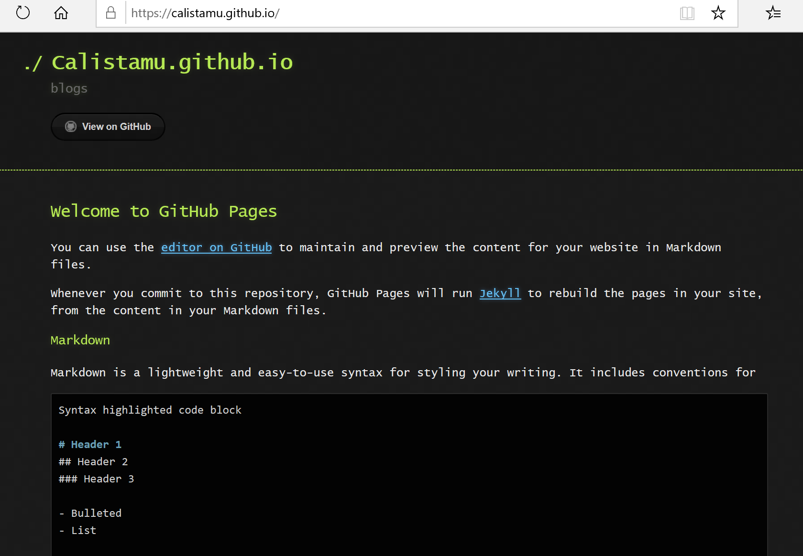
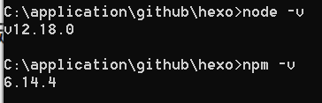
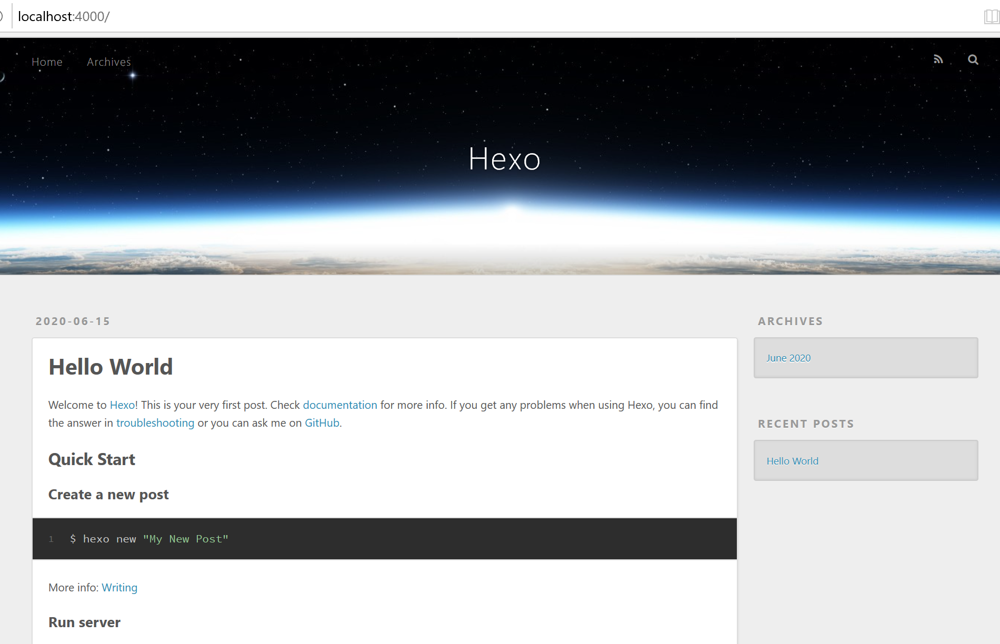
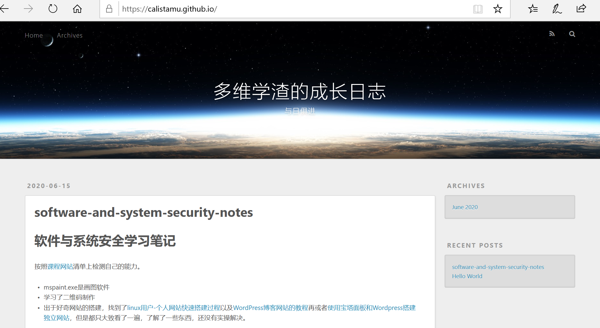

# 学渣的自我修养(与日俱进)

## 2020.6.10
2020.6.10之前，学习了:二维码+python的itchat库+python的turtle库。
今日学习：了解了csp认证和codeforces+上了"腾讯犀牛鸟t-star"比赛第二课
### 二维码  
[二维码](https://zh.wikipedia.org/wiki/%E4%BA%8C%E7%B6%AD%E7%A2%BC)和[条形码](https://zh.wikipedia.org/wiki/%E4%B8%80%E7%BB%B4%E6%9D%A1%E7%A0%81)的[区别](https://blog.csdn.net/dcrmg/article/details/52106805)  
* 二维码是一个总的概念。常见的二维码有：PDF417码、汉信码、颜色条码、[QR码](https://zh.wikipedia.org/wiki/QR%E7%A2%BC)  

[二维码、QR码、DM码的区别](https://my.oschina.net/jeffzhao/blog/104854)  
[二维码的生成细节和原理](https://coolshell.cn/articles/10590.html)  
二维码制作  
[word制作二维码](https://zhuanlan.zhihu.com/p/55545264)、[excel制作二维码](https://zhuanlan.zhihu.com/p/30831696)、各种编程代码制作二维码([python动态二维码制作](https://blog.csdn.net/qq_40733911/article/details/81087595?depth_1-utm_source=distribute.pc_relevant.none-task&utm_source=distribute.pc_relevant.none-task))、软件制作二维码、[草料二维码网站动态二维码制作](https://zhuanlan.zhihu.com/p/34125837)以及别的在线生成器  
[动态二维码与静态二维码的区别](https://blog.qrstuff.com/2012/08/12/dynamic-qr-codes)  
[动态二维码](https://www.qr-code-generator.com/qr-code-marketing/more-information-more-flexibility/)与动图二维码不同

### python-itchat
完成了微信自动回复和机器人聊天  
[仓库地址](https://github.com/Calistamu/wechatrobot)  
[图灵机器人](http://www.turingapi.com/)  
### python-turtle
可以自动画图，保存了一个自动化小猪佩奇的代码。  
>code/peggi.py

## 2020.6.13
今日学习总结：  
* utools
* emoji
* 语雀
* daygram
* 科学上网
* sqlmapK
* win10手势
* 玩转vs code
* zoomit
* 规则引擎
### utools
[utools官网](https://u.tools/)    
学习文章：[黑科技神器-uTools](https://www.cnblogs.com/goodAndyxublog/archive/2020/03/14/12490721.html)
* 比[wox](http://www.wox.one/)+[everything](https://www.voidtools.com/)或者Alfred插件更多，性能更好，平台跨越更宽，更方便快捷
* 了解到emoji插件，拓展学习[Markdown玩转Emoji](https://www.jianshu.com/p/e66c9a26a5d5)  
总结：  
首先vs code要下载相应插件    
表情获得：[emoji-cheat-sheet](https://www.webfx.com/tools/emoji-cheat-sheet/)，但是utools可以立刻获得:grinning:  
#控制尺寸  
代码块中增加：print(":grinning:")

### 语雀
[语雀官网](https://www.yuque.com/)   
[使用手册](https://www.yuque.com/yuque/help/)
* 我用过的笔记：  
印象笔记(收费)  
onenote(windows用户)  
有道云笔记(跨平台、同步方便，免费) 
* 语雀不支持手机
* 支持历史版本，对于附件和第三方服务更方便，比vs code编写markdown更方便


### daygram
用过很多的日志记录软件，最喜欢这款，极简方便。安卓免费。

### 科学上网
[fanqiang](https://github.com/bannedbook/fanqiang)

### sqlmap
python编写的sql注入工具。[sqlmap](https://github.com/sqlmapproject/sqlmap)
### win10手势
[适用于 Windows 10 的触摸板手势](https://support.microsoft.com/zh-cn/help/4027871/windows-10-touchpad-gestures)
### 玩转vscode

#### 快捷键：  
* ctrl+P:  
1. 弹出搜索栏，直接输入关键字，在所有文件中搜索特定符号
2. 搜索栏前输入”@“，在当前文件中搜索特定符号 
3. 搜索栏前输入”>“，搜索所有可使用的命令
#### 插件：
* Auto Close Tag---自动闭合html标签
* Auto Rename Tag ---修改html标签时，自动修改匹配的标签* * Code Spell Checker ---单词拼写检查
* Copy Relative Path ---获取文件相对路径
* Bracket Pair Colorizer ---使用颜色标识匹配的括号
* GitLens --单击代码行就可以看到编辑它的人，时间，提交的内容
* Code Runner ---代码片段运行调试，支持多种语言
* Remove Comments ---一键删除当前文件的注释，支持40多种语言
* Image preview ---实现图片预览功能；
* [powermode](https://marketplace.visualstudio.com/items?itemName=hoovercj.vscode-power-mode)---敲字特效
#### git+vs code
[Git version control in VS Code](https://code.visualstudio.com/docs/introvideos/versioncontrol)
### zoomit
[ZoomIt v4.5.2](https://docs.microsoft.com/en-us/sysinternals/downloads/zoomit)  

### 规则引擎
大创开发的时候了解到规则引擎：ckrule和drools。知识有了理论认知，没能实现

## 2020.6.15

### git写博客
* 还可以用gridea
本次学习使用了[hexo](https://hexo.io/)  
* 参考[超详细Hexo+Github博客搭建小白教程](https://zhuanlan.zhihu.com/p/35668237)及各个官方文档
1. 仓库准备

github与本地连接

```
# git has been installed
git config --global user.name "你的GitHub用户名"
git config --global user.email "你的GitHub注册邮箱"
ssh-keygen -t rsa -C "你的GitHub注册邮箱"
# 打开GitHub_Settings_keys 页面，新建new SSH Key
# 在Git Bash中检测GitHub公钥设置是否成功，输入ssh git@github.com
```

github建仓库

* 仓库名称一定是：用户名.github.io

* public+travis+initialize readme.md

* 仓库setting中enable github page+select a theme,pr以后再次进入setting看到自己网页的url

  

1. install nodejs
   * [nodejs-download](https://nodejs.org/en/download/)
   * 附带下载了chocolatey
   * 添加到环境变量
   * [nodejs-doc](https://nodejs.org/en/docs/) 
     
```bash
node -v #node.js版本信息
npm -v #npm版本信息
```

 

3. Install Hexo
   * [hexo-doc](https://hexo.io/docs/)

```
# 新建一个文件夹
# cd 新建文件夹
# 或npm install hexo
npm install -g hexo-cli
# 查看版本验证成功
hexo -v 

# 本地建一个空文件夹并cd进入
# 初始化文件夹
hexo init
# 生成静态网页
hexo g
# 打开本地服务器
hexo s
# 浏览localhost:4000/,看到hexo的页面就成功了
```
啊

4. hexo-github deploy
* [hexo-configureation](https://hexo.io/docs/configuration.html)
* [GitHub Pages](https://hexo.io/docs/github-pages)
* [超详细hexo+github page搭建技术博客教程](https://segmentfault.com/a/1190000017986794)

```
npm install hexo-deployer-git --save

cd ./hexo
# 打开_config.yml,如下设置必选
deploy:
  type: git
  repository: https://github.com/用户名/用户名.github.io
  branch: master

# generate and deploy
hexo g -d
# 出现弹窗输入github账号密码登录
# 为了方便区分，拷贝一个本地的.md到/source/_posts中（这个文件夹默认存储博客页面）。再次访问看到页面变了。
```



5. 更换主题

   从[themes](https://hexo.io/themes/)中选择一个，git clone 到hexo/theme/文件夹下。

   * 不同主题的github仓库中有相应的说明
   * [Hexo-GitHub搭建个人博客配置教程](https://bainingchao.github.io/2018/09/19/Hexo-GitHub%E6%90%AD%E5%BB%BA%E4%B8%AA%E4%BA%BA%E5%8D%9A%E5%AE%A2%E9%85%8D%E7%BD%AE%E6%95%99%E7%A8%8B/)
   * [超详细Hexo+Github博客搭建小白教程](https://zhuanlan.zhihu.com/p/35668237)

6. 添加动漫人物

   ```
   npm install --save hexo-helper-live2
   npm install live2d-widget-model-shizuku
   # ——config.yml
   live2d:
     enable: true
     scriptFrom: local
     pluginRootPath: live2dw/
     pluginJsPath: lib/
     pluginModelPath: assets/
     tagMode: false
     log: false
     model:
       use: live2d-widget-model-shizuku
     display:
       position: right
       width: 150
       height: 300
     mobile:
       show: true
     react:
       opacity: 0.7
   
   ```

   

7. 添加水印

   根目录下增加watermark.py,内容如下：

   ```
   # -*- coding: utf-8 -*-
   import sys
   import glob
   from PIL import Image
   from PIL import ImageDraw
   from PIL import ImageFont
   
   
   def watermark(post_name):
       if post_name == 'all':
           post_name = '*'
       dir_name = 'source/_posts/' + post_name + '/*'
       for files in glob.glob(dir_name):
           im = Image.open(files)
           if len(im.getbands()) < 3:
               im = im.convert('RGB')
               print(files)
           font = ImageFont.truetype('STSONG.TTF', max(30, int(im.size[1] / 20)))
           draw = ImageDraw.Draw(im)
           draw.text((im.size[0] / 2, im.size[1] / 2),
                     u'@yourname', fill=(0, 0, 0), font=font)
           im.save(files)
   
   
   if __name__ == '__main__':
       if len(sys.argv) == 2:
           watermark(sys.argv[1])
       else:
           print('[usage] <input>')
   
   ```

   ```
   # usage
   python3 watermark.py postname
   python3 watermark.py all
   ```

   

8. 解决.md中没有图片

   * [在Hexo博客中插入图片的各种方式](https://fuhailin.github.io/Hexo-images/)

   ```
   # 修改_config.yml,实现的方式有多种，这里选择相对路径本地引用的方式
   post_assert_folder:true
   # 在hexo/source/_posts/内将图片放到与md文件同名文件夹中
   ```

9. 增加字数统计和阅读时长
```
npm install hexo-symbols-count-time --save

# _config.yml中设置
# 文章字数统计
symbols_count_time:
  symbols: true
  time: true
  total_symbols: true
  total_time: true
```

### Typora

虽然之前就了解到了[typora](https://typora.io/)，今天才认识到这个写markdown的工具有多么好，确实在写.md方面比vs code方便很多很多。

### LaTex

[LaTex](https://www.latex-project.org/)

对于windows有三种选择：  

* MiKTex(选择了这种)
* proTeXt
* TeX live

## 2020.6.15

### bilibili投稿工具
解决了bilibili视频合集的问题

## 2020.6.19

* dirtycow
* 反弹shell
* swp文件
* cookie vs session
* kali的xss测试工具
* Verilog

### dirtycow

[dirtycow](https://dirtycow.ninja/)的CVE编号：CVE-2016-5195

* 只是了解，没有进行漏洞复现

### 反弹shell

[Linux反弹shell（一）文件描述符与重定向](https://xz.aliyun.com/t/2548)  

[Linux 反弹shell（二）反弹shell的本质](https://xz.aliyun.com/t/2549#toc-0)

* 只是了解，没有进行实验，想起ns入侵提权

###  swp文件

[关于vi不正常退出产生的swp文件](https://xz.aliyun.com/t/2549#toc-0)

### cookie vs session

[What is the difference between session and cookies?]([https://www.tutorialspoint.com/What-is-the-difference-between-session-and-cookies#:~:text=Cookies%20and%20Sessions%20are%20used,as%20well%20as%20a%20server.&text=A%20session%20creates%20a%20file,and%20their%20values%20are%20stored.](https://www.tutorialspoint.com/What-is-the-difference-between-session-and-cookies#:~:text=Cookies and Sessions are used,as well as a server.&text=A session creates a file,and their values are stored.))

cookie个性化投放示例：[Cookies: Personalized surfing-lufthansaeXperts](https://www.lufthansaexperts.com/lang/cns/cookies-personalized-surfing.html)

### kali的xss测试工具

[beef](https://beefproject.com/)

[xsser](https://tools.kali.org/web-applications/xsser)

### [Verilog](https://en.wikipedia.org/wiki/Verilog)

### 视频加字幕工具

面包视频（app）  

[网易见外工作台](https://jianwai.youdao.com/)

[arctime](https://arctime.org/)

[aegisub](http://www.aegisub.org/)

[小丸工具箱](https://maruko.appinn.me/)

### 电子书

#### 博看网（图书、期刊、报纸）

[博看书苑](http://zq.bookan.com.cn/?t=index&id=23501)
[博看书苑APP下载](http://download.bookan.com.cn/)

#### 多格式电子书下载

[ePUBw](https://epubw.com/)
[ePUBee](http://cn.epubee.com/books/)
[周读](http://www.ireadweek.com/)
[千百度](https://hotbaidu.com/)
[三秋书屋](https://www.d4j.cn/)
[我的小书屋](http://xngisha.com/)

#### PDF印刷版电子书下载

[PDF之家](http://pdfzj.cn/)
[读书皮](http://slfswh.xiangzhan.com/)
[E书联盟](http://www.book118.com/)
[码农之家](http://www.xz577.com/)
[搬书匠](http://www.banshujiang.cn/)

#### 图书资源搜索引擎

[鸠摩搜书](https://www.jiumodiary.com/)
[智奇搜书](https://www.zqbook.top/)
[梅子搜报网](http://mz.soubao.net/#/meizi/searchIndex)