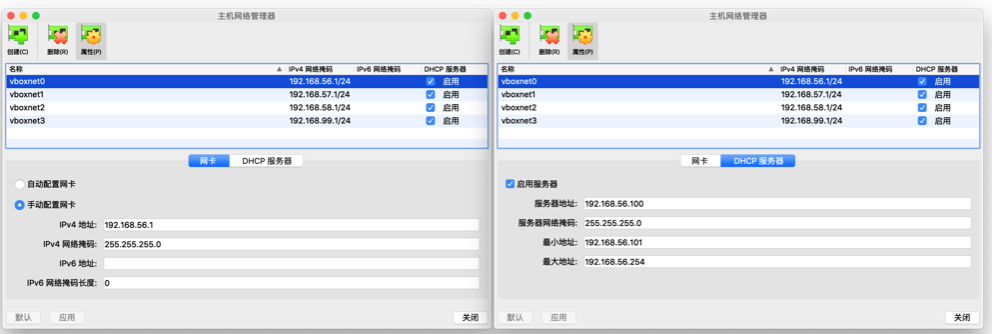

                # 2019.9.12 

[校内访问](sec.cuc.edu.en?_blank)  
[校外访问](https://github.com/c4pr1c3/cuc-wiki?_blank)  
[往届仓库示例](https://github.com/CUCCS?_blank)  
[教学视频](sec.cuc.edu.cn/ftp/video?_blank)  
[教材](https://c4pr1c3.github.io/cuc-mis/?_blank)  
[课件](sec.cuc.edu.cn/huangwei/cuc-wiki/courses/2017/misLecture0x01.pdf?_blank)  
[公开仓库](https://classroom.github.com/a/nf63lwDF?_blank)  
[私有仓库](https://classroom.github.com/a/UP5b348p?_blank)   

## 基本概念
了解了电力猫  
热点  
802.11链路层和物理层，与网络层没有关系，黑盒化向上封装  
每一个路由器能够构建一个独立的BSS，都使用同一个SSID  
SS（service stack）sta(station,其实就是终端设备比如手机平板)
mac地址前缀相同说明是同一厂商  
如何发现前缀不同，说明可能是别人搭建的钓鱼网站  
单个网络设备同时建立多个网络，SSID仅仅是区分不同的网络
好的服务器是平滑切换
每一层有每一层的检测方法，Ping不通不一定是网络层有问题  
一个基本的物理网络可以没有路由的功能，仅仅交换就可以  
信道设置  
敏感信息记得遮盖  
kismac是mac上的嗅探工具  
一般笔记本中的无线网卡，厂商自动禁用了监听模式   
STA关联AP，历史关联记录优先，先发现，先关联，信号强度高者优先，无线嗅探，无线网络太危险，有线更安全  
无线网络连接，访问不需要同意就能够读取照相机里面的照片是怎么做到的？  
openwrt可以装在virtualbox中

## 如何写实验报告

### 5W2H

what 实验报告的准确标题、做了哪些实验、实验结论/观测现象是什么  

* 一定要有标题，不要狂贴图 

why 上述结论的依据、观测现象的产生原因是什么  

* 解释结论与观测现象，给出客观依据

when 以无限抓包分析实验为例，展示wireshark的抓包统计信息：抓包持续时间、实际起止时间

* 抓包起止时间，抓包信息

who 本次实验报告得到了哪些人的帮助？参考文献引用标注要清晰和全面，第四章网络安全监听的实验（arp或其他的劫持方式，劫持时间或手段对打击有没有影响） 
    
* 标注出参考链接。数据包抓包的无线网络谁搭建的，是否能连互联网，描述接入环境，描述不同互联网接入条件下的实验情况。 容器或者虚拟环境

where 本次实验的网络拓扑、虚拟机还是容器环境？局域网还是互联网环境？wifi/有限/4G接入条件等等  

* 出现问题的场景要描述清楚

How实验操作步骤描述、代码、配置文件、完整命令行等  

* 命令行统计,越专业越好

how much 报告的篇幅（并非越长越好，原创内容为主，避免复制粘贴参考资料中内容）、图片的后期处理（标注、尺寸裁剪）、操作录像（精简、避免无效操作、剪辑掉长时间的静止画面）、排版（markdown使用规范性、易读性）

*  原创性内容，加工整理

## 安装kali

* 关于系统安装  
  安装系统的时候，选对位数就可以，具体版本没关系，主要是生成一堆虚拟硬件的初始配置，要知道存储位置。  

install(文本安装，live光盘模式选这个就无法保存在虚拟机中，graphical insatll是图形化界面)-english(避免奇怪翻译)-hongkong-american english-网卡eth0（nat网卡，如果没有hostonly需要手动创建，记得要开启dhcp服务，没有启动地话分配到hostonly的虚拟机无法自动设置地址，启用后默认分配了一个没有被占用的网段，也配置好了网卡。正常情况下不需要手工设置，若有例外，抄一个别人的，因为仅自己可见）-选guided(若是装服务器硬盘不要选择向导式，选manual，第三个加密方式的一旦出现分区卷的错误，不可恢复数据，第二个软件模式模拟的read提供更好的可靠性，由于虚拟机所以选择向导式)

* 先备份，再使用  

lsb查看设备  
iw dev查看网卡基本信息  
iw phy查看网卡物理信息  

# 2019.9.19

## 下载了文件应该校验完整性

鼠标操作或者命令行
         
        查看文件的md5校验码
        certutil -hashfile filename MD5
        查看文件的sha1校验码
        certutil -hashfile filename SHA1
        查看文件的sha256校验码
        certutil -hashfile filename SHA256

## 验证真实性

（如果我们能攻击kali的服务器，换掉镜像，那么我们也可以更换校验码，那么验证完整性显得不堪一击）  
opengpg工具  
kali网上有例子命令行操作

## 虚拟机应该开启dhcp服务+虚拟机拓展包的安装下载+全局中可以设置多个网络
        
        列出dhcp参数
        vboxmanage list dhcpservers
        修改dhcp参数
        vboxmanage dhcpserver modify

虚拟机的设置相当于影响的是链路层

        lsusb列出Usb信息

USB设备过滤器
新系统应该先做纯净系统的备份
   
        iw dev查看网卡基本信息
        iw phy查看网卡物理信息

## 跟着视频操作后发现 Kali 安装完成后无法上网

完整复制以下代码到「终端」运行
     
     grep "iface eth1 inet dhcp" /etc/network/interfaces || cat << EOF >> /etc/network/interfaces
     auto eth0
     iface eth0 inet dhcp
     auto eth1
     iface eth1 inet dhcp
     EOF

重启网络管理服务

     systemctl restart networking

检查确认两块网卡都已分配到了正确的 IP
      
     ip a

## 无法通过 ssh 访问 Kali

默认安装完 Kali 后，系统未开启 SSH 服务，且默认 SSH 服务配置禁止 root 用户使用口令方式登录，因此需要按照以下方式操作一遍才能正确开启 SSH 服务。   
            
      grep -q 'PermitRootLogin yes' /etc/ssh/sshd_config || echo 'PermitRootLogin yes' >> /etc/ssh/sshd_config  

设置 SSH 服务为开机自启动

      systemctl enable ssh  

启动 SSH 服务
  
      systemctl start ssh  

## 一些工具介绍
[chocolatey安装](https://chocolatey.org/courses/installation/installing?method=installing-chocolatey?_blank)包管理工具方柏霓安装  
[WSL2安装](https://docs.microsoft.com/zh-cn/windows/wsl/wsl2-install?_blank)  
[cmder安装](https://cmder.net/?_blank)建议完整版，自带了很多linux工具的windows移植版  
生成公私钥对是为了不必每次都输入口令    
NAT网络无法满足使用宿主机访问  
openssh高级用法  

## 实现文件共享

### SSH

ssh密钥生成

     1、打开git bash
     2、执行生成公钥和私钥的命令：ssh-keygen -t ras -b 4096（为什么按三下，是因为有提示你是否需要设置密码，如果设置了每次使用Git都会用到密码，一般都是直接不写为空，直接回车就好了）。会在一个文件夹里面生成一个私钥 id_rsa和一个公钥id_rsa.pub。（可执行start ~ 命令，生成的公私钥在 .ssh的文件夹里面）
     3、执行查看公钥的命令：cat ~/.ssh/id_rsa.pub

ssh

       ssh root@192.168.56.107
       #ssh以后就可以访问虚拟机
       ssh-copy-id -i ~/.ssh/id_rsa.pub root@192.168.56.129
       #将公钥拷贝到远程主机上，免登录

       用一个跳板让windows访问Mac上的虚拟机，windows与mac在同一个网段
       -j 与ssh的版本有关

* -v/-vv提高消息的输出和冗余的级别
* openssh高级用法，有书

## windows访问mac上的虚拟机
[mac虚拟机桥接模式](https://blog.csdn.net/fightxxl55/article/details/53009365?_blank)  
[另一个示例](https://blog.csdn.net/yangzaiqiu1986814/article/details/50788263?_blank) 

pwd查看当前路径，文件共享，使用scp
       
       scp C:\Users\76419\Desktop\2019.txt root@192.168.56.107:/root/
       #用户名 @主机Ip : 虚拟机内存储该文件的绝对路径
       #发现路径下确实多了2019.txt
       echo 'hello world' >2019.txt
       #向2019.txt写入内容
       scp root@192.168.56.107:/root/2019.txt C:\Users\76419\Desktop\exe
       #拷贝源 目的源 再拷贝回物理机，发现确实同步了
 

* 正确的学习方法：看官方文档，一定要注意版本  

* 下载软件建议下载稳定版本 

### [kali官方安装增强功能](https://docs.kali.org/general-use/kali-linux-virtual-box-guest?_blank)

多重加载相当于创建了一个只读的文件系统  
squashfs ex4 openwrt.org/docs/techret  
查错误应该查错误关键字  
看文章的时候要仔细  

## openwrt开源的无线路由器，无线仿真的路由器

在路由器上进行漏洞的挖掘和复现，如何对路由器逆向工程，对他的配置文件进行编解码，加解密  

## 路由器的配置文件
使用路由器导出配置文件---搜索“路由器 品牌名 backup decoder”，例如 tp link router backup decoder---打开Zibri's Blog: TP-LINK Configuration file encrypt and decrypt，上传备份文件---得到解码后的明文路由器配置文件

* 具体操作？
* 检查一下明文配置内容是否都在文件中可以找到？
* 用浏览器的调试工具分析一下【备份文件】功能的网络通信过程，有没有安全风险？

## openwrt安装
 
1. >方法一

     
       # 下载镜像文件
       wget https://downloads.openwrt.org/snapshots/targets/x86/64/openwrt-x86-64-combined-squashfs.img.gz
       # 解压缩
       gunzip openwrt-x86-64-combined-squashfs.img.gz
       # img 格式转换为 Virtualbox 虚拟硬盘格式 vdi
       VBoxManage convertfromraw --format VDI openwrt-x86-64-combined-squashfs.img openwrt-x86-64-combined-squashfs.vdi
       # 新建虚拟机选择「类型」 Linux / 「版本」Linux 2.6 / 3.x / 4.x (64-bit)，填写有意义的虚拟机「名称」
       # 内存设置为 256 MB
       # 使用已有的虚拟硬盘文件 - 「注册」新虚拟硬盘文件选择刚才转换生成的 .vdi 文件

>方法二

[openwrt安装教程](https://openwrt.org/docs/guide-user/virtualization/virtualbox-vm？_blank)
[openwrt官方镜像下载](https://downloads.openwrt.org/?_blank)  

* 对于在 VirtualBox 中安装 OpenWrt 来说首选 x86 架构的镜像文件以获得最好的运行兼容性保证。

* 第一块网卡设置为：Intel PRO/1000 MT 桌面（仅主机(Host-Only)网络）
第二块网卡设置为：Intel PRO/1000 MT 桌面（网络地址转换(NAT)）

2.ip addr查看网段
3.vi  /etc/config/network

* eth0 对应我们预先设置的第一块虚拟网卡，该网卡的网络类型设置为host-only并已查看过对应网段192.168.56.0/24,openwrt的lan端口通常呗声明用于管理端口，对应内网，只支持静态配置ip virtualbox的host-only默认dhcp地址池定义从.100开始，此处设置一个不会引起ip地址冲突的地址即可

4./etc/init.d/network restart重启网络使变更生效

5.对于路由器操作系统 OpenWrt 来说，更常见的远程管理方式是通过 LuCi 这个网页形式的管理界面来完成

     # 更新 opkg 本地缓存
     opkg update

     # 检索指定软件包
     opkg find luci
     # luci - git-19.223.33685-f929298-1

     # 查看 luci 依赖的软件包有哪些 
     opkg depends luci
     # luci depends on:
     #     libc
     #     uhttpd
     #     uhttpd-mod-ubus
     #     luci-mod-admin-full 
     #     luci-theme-bootstrap
     #     luci-app-firewall
     #     luci-proto-ppp
     #     libiwinfo-lua
     #     luci-proto-ipv6

     # 查看系统中已安装软件包
     opkg list-installed

     # 安装 luci
     opkg install luci

     # 查看 luci-mod-admin-full 在系统上释放的文件有哪些
     opkg files luci-mod-admin-full
     # Package luci-mod-admin-full (git-16.018.33482-3201903-1) is installed on root and has the following files:
     # /usr/lib/lua/luci/view/admin_network/wifi_status.htm
     # /usr/lib/lua/luci/view/admin_system/packages.htm
     # /usr/lib/lua/luci/model/cbi/admin_status/processes.lua
     # /www/luci-static/resources/wireless.svg
     # /usr/lib/lua/luci/model/cbi/admin_system/system.
     # ...
     # /usr/lib/lua/luci/view/admin_network/iface_status.htm
     # /usr/lib/lua/luci/view/admin_uci/revert.htm
     # /usr/lib/lua/luci/model/cbi/admin_network/proto_ahcp.lua
     # /usr/lib/lua/luci/view/admin_uci/changelog.htm

6.VirtualBox 本身无法提供无线网卡的虚拟化仿真功能,使用无线网卡，openwrt默认没有无线网卡的相关驱动程序

7.openwrt，lsusb查看当前待接入USB无线网卡芯片信息，但是默认情况下openwrt没有对应的软件包

    opkg update && opkg install usbutils

检查驱动

    # 查看 USB 外设的标识信息
    lsusb
    # Bus 001 Device 005: ID 0cf3:9271 Qualcomm Atheros Communications AR9271 802.11n
    # Bus 001 Device 006: ID 0bda:8187 Realtek Semiconductor Corp. RTL8187 Wireless Adapter

    # 查看 USB 外设的驱动加载情况
    lsusb -t
    # /:  Bus 01.Port 1: Dev 1, Class=root_hub, Driver=ehci-pci/12p, 480M
    #     |__ Port 1: Dev 4, If 0, Class=(Defined at Interface level), Driver=, 480M
    #     |__ Port 2: Dev 5, If 0, Class=Vendor Specific Class, Driver=ath9k_htc, 480M

7.
# 2019.9.26

无线网卡驱动需要手动安装：对网卡的检查工具iwconfig/iw  
抓包器：wireshark、tshark(wireshark安装后的命令行版本)、airodump-ng  
监听模式不需要加入任何一个无线网络
channel hopping如果不进行，不知道到底工作在哪一个channel上  
无线网卡智能工作在一个确定的频道上，没有进行channelhopping的时候是不能抓包的，只能知道在哪一个频道上  
backtrack是kali的前身，预置了安全相关软件以及驱动，不需要自己去安装  
ifconfig 通用的网卡设置工具  
<>必选参数，内部是互斥参数[]是可选参数  
五元组：源地址目的地址，源端口目的端口，传输类型  

     echo -e ""
     换不同的解码方式进行解码

故障排错的思路和方法一定要看，虽然有很多个接口但是有些是供电不足的
channelhopping的频率时间是可以更改的，  
dldumpng封装了  
要保存数据包不能在channelhopping模式下  
可以在虚拟机直接分析抓到的包  
去掉负号，数字越大信号越强，为什么秒连网络，是因为beacons  
可以选择过滤规则，与一个地址相关的五种类型的地址都可以得到  
抓包时间足够长，抓包数量比较多，可能一两天都没抓到特别的小概率的SSID，可以查资料，不要只查资料，不信任规则  
wireshark可视化显示，wireless-traffic  
抓包的时候尽可能不加我了解的过滤数据，在分析的时候再加条件  
同时提供完整性和真实性的加密模式才能算是安全的  
AEAD模式要了解  
如何安全地存储哈希PBKDF，PBKDF要了解
很多地SSID是一样的

# 2019.9.27

allow-hotplug 没有网络也不影响  
post-down  
如果没有Hostonly,应该删除相应的接口设置，网卡的设置于Interfaces的设置要一只  
etc/dnsmasq.d/gw-enp0s9.conf以及etc/dnsmasq.d/gw-enp0s10.conf  
Link local 169.254..保留地址[了解169.254.0.0](https://serverfault.com/questions/118324/what-is-a-link-local-address?_blank) 

 * 在IP网络里，每台主机都需要一个IP地址，通常情况下是通过DHCP服务器自动分配，但某些特殊情况下，DHCP分配失败或者没有DHCP服务器时，机器可以自己分配一个IP来完成这个工作。  
 我的理解，这么做的目的是为了数据格式统一，程序处理不那么容易出BUG;  
 就好比我定义一个指针，正常情况下这个指针会被赋予某个数据类型的地址信息，但如果赋值失败的时候，我不能什么都不做，我也得给它赋值，通常是赋为NULL；这个NULL就好比169.254/8；

只有做好每一个细节，才能让你的能力在不知不觉中，肉眼可见的提升。  
版权意识，留下自己的身份标识  
学习先进的方法  
只要你有那份心，一定是能学到好的学习方法  

## 第二章

弱点评价系统CVSS  
安全是持续循环的  
按照镜像的名称杀死进程  
证书查看器，证书是一层一层的，根证书一般内置在操作系统中，如果根证书出问题，可以通过物理的方式再次生成新的证书，数字证书具有防篡改性。  
internet-内容-证书  
访问控制bypass  
代码和配置的分离
仅靠ip地址是不行的
自主访问控制：作为权限的所有者可以自主地根据自己的需要进行设置。    
软件安全就是研究在没有源码的情况下，我直接修改二进制文件    
基于角色的访问控制是特殊的强制访问控制    
属主权限是一种特殊的权限，所有者可以在有权限的用户里面也可以不在    
强制访问控制模型  
blp和lattice 保密性模型，上写下读  
BiBa模型 完整性模型，上读下写，系统更新的时候可以体会到，完整性高的模型可以向完整性低的用户提供数据，由于我们是自主访问用户，因此我们可以对权限进行重新划分    
sql不仅可以看数据，还可以向数据库写入数据  
低危漏洞的组合可以达到高危漏洞的效果，高危漏洞如果没有正确的漏洞利用，同样没有效果  
cass calculator漏洞评分计算器，打分过程基于我们对漏洞的客观认识，加上主观评价，但是不会有特别大的偏差，CVE攻击公开的漏洞信息数据库  
[识别ip地址](www.myip.cn)  
代理服务器的寿命都不长  
HSTS需要网站通过代码的方式加入到机制里面  
proxychains4 curl 链接，windows上下载curl    
老师的知乎，百付宝  
反向代理是什么：正向代理隐藏真实客户端，反向代理隐藏真实服务端  
内容小偷网站  
镜像代理  

# 第二章 无线接入网监听

## 无线网络监听的基本条件
- 无线网卡
- 无线网卡驱动 kali是不需要安装的,openwrt需要安装，无线网卡设置工具iwconfig
- 抓包器 wireshark\tshark\airodump-ng\tcpdump(课本有如何抓无线数据包的方法)
   * 是在无线网卡没有加入到任何一个无线网络的情况下监听和嗅探，是为了获得链路层802.11的帧结构信息
- 操作系统支持设置无线网卡进入monitor模式
   * 无需加入任何一个BSS，无需绑定到一个AP或进入Ad-Hoc模式，无线网卡通过channel hopping 技术在多个channel之间快速切换，捕获802.11数据帧
-

2019.10.17
VS code的远程功能
cat /etc/resolv.conf查看域名解析服务器
namesever 202.205.
没有消息就是最好的消息
最小化的字典爆破密码，知识星球上看github.com/brannondorsey/PassGAN根据个人信息，破解成功率很高
 